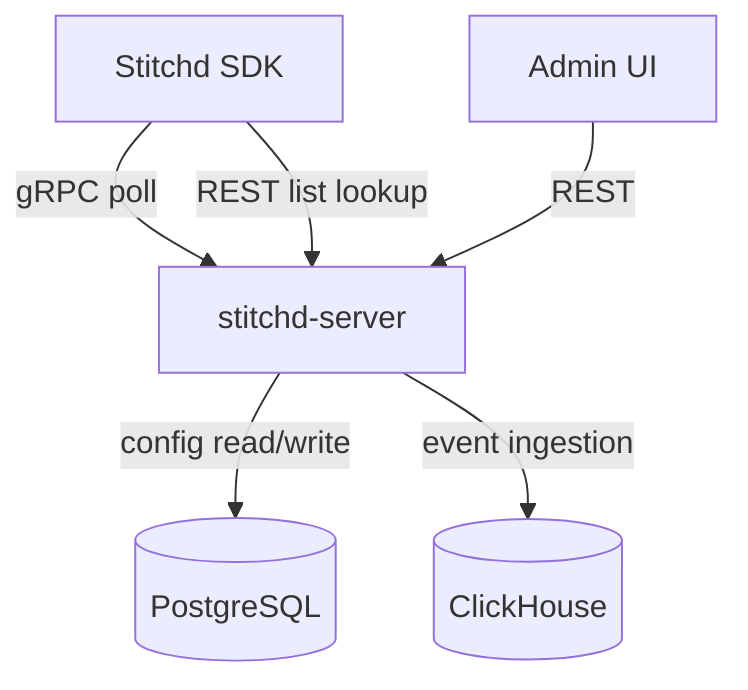

# System Overview

Stitchd Feature Flag is a self-hosted feature flagging and experimentation platform.

## Components

| Component | Purpose |
|-----------|---------|
| `stitchd-server` | Admin REST API + gRPC SDK protocol |
| `stitchd-sdk` | Server-side Rust SDK (in-process evaluation) |
| `stitchd-core` | Domain model, rule engine, segmentation |
| `stitchd-db` | Database access layer (sqlx + ClickHouse) |
| `stitchd-proto` | Protobuf definitions for gRPC protocol |
| `stitchd-events` | Event ingestion and metric aggregation |
