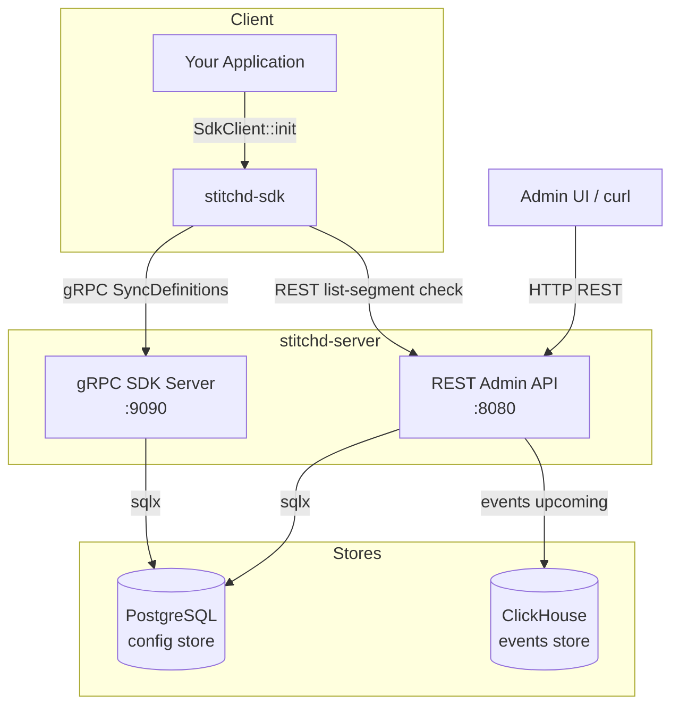

# System Architecture

Stitchd Feature Flag is a self-hosted feature flagging and experimentation platform
built on a small set of Rust crates with two external data stores.

## High-Level Diagram

## Crate Map

| Crate | Purpose |
|-------|---------|
| `stitchd-server` | Admin REST API (Axum) + gRPC SDK server (tonic) |
| `stitchd-sdk` | Server-side Rust SDK — in-process flag evaluation |
| `stitchd-core` | Domain model, rule engine, segmentation logic |
| `stitchd-db` | Database access layer (sqlx + ClickHouse) |
| `stitchd-proto` | Protobuf definitions and generated tonic stubs |
| `stitchd-events` | Event ingestion and metric aggregation *(upcoming)* |

## Design Principles

**In-process evaluation** — The SDK syncs flag definitions via gRPC on startup and keeps
them in memory. Rule evaluation happens locally with zero network hops per request.

**Dual data store** — PostgreSQL handles transactional config; ClickHouse handles
append-only, analytical event data. The two stores are intentionally separate so event
load cannot affect flag evaluation latency.

**Multi-tenancy at the project level** — A single server instance hosts multiple tenants.
Isolation is enforced at the database layer; every query is scoped to a tenant/project/env.

## Further Reading

- [Flag Evaluation Flow](./evaluation-flow.md)
- [Multi-Tenancy Model](./multi-tenancy.md)
- [Data Stores](./data-stores.md)
