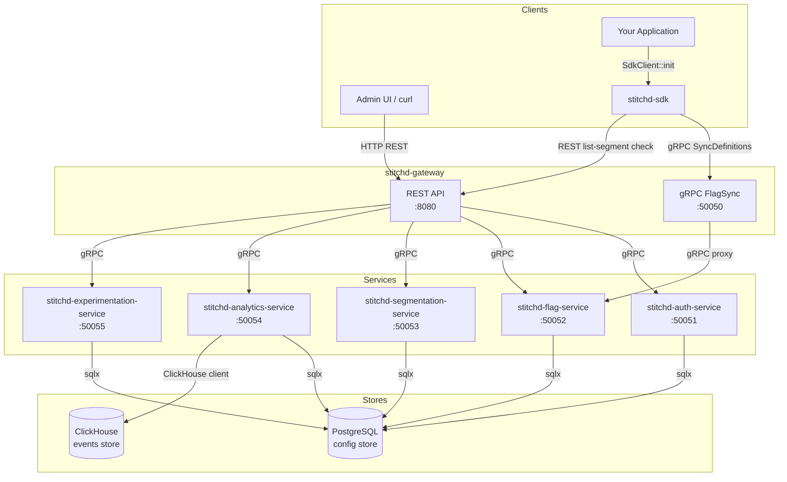

# System Architecture

Stitchd Feature Flag is a self-hosted feature flagging and experimentation platform
built on a small set of Rust crates with two external data stores.

## High-Level Diagram

## Crate Map

| Crate | Role | Type |
|-------|------|------|
| `stitchd-gateway` | REST + gRPC gateway — single entry point for all external traffic | Binary |
| `stitchd-auth-service` | Authentication (login, JWT) and organisation/project management | Binary |
| `stitchd-flag-service` | Flag definitions, variant management, SDK flag-sync streaming | Binary |
| `stitchd-segmentation-service` | Segment membership evaluation and list-segment checks | Binary |
| `stitchd-analytics-service` | Experiment event ingestion, forwarded to ClickHouse | Binary |
| `stitchd-experimentation-service` | Experiment CRUD and result aggregation | Binary |
| `stitchd-stats-service` | Scheduled statistics computation (60-min loop), on-demand recompute jobs, `stats_jobs` + `stats_schedule` management | Binary |
| `stitchd-sdk-rust` | Server-side Rust SDK — in-process flag evaluation | Library |
| `stitchd-core` | Domain model, rule engine, segmentation logic, hashing, ID types | Library |
| `stitchd-db` | Database access layer (sqlx repositories + ClickHouse) | Library |
| `stitchd-proto` | Protobuf definitions and generated tonic stubs for all services | Library |
| `stitchd-event-writer` | ClickHouse event ingestion and migration helpers | Library |
| `xtask` | Build tool: mdBook docs generation, tool installation | Binary |

## Design Principles

**Gateway-fronted microservices** — All external traffic (admin API, SDK flag sync, event
ingestion) enters through `stitchd-gateway`. Backend services are never exposed directly,
making it straightforward to add auth, rate limiting, or TLS termination in one place.

**In-process evaluation** — The SDK syncs flag definitions via gRPC on startup and keeps
them in memory. Rule evaluation happens locally with zero network hops per request.

**Dual data store** — PostgreSQL handles transactional config; ClickHouse handles
append-only, analytical event data. The two stores are intentionally separate so event
load cannot affect flag evaluation latency.

**Multi-tenancy at the project level** — A single deployment hosts multiple tenants.
Isolation is enforced at the database layer; every query is scoped to a tenant/project/env.

## Further Reading

- [Flag Evaluation Flow](./evaluation-flow.md)
- [Multi-Tenancy Model](./multi-tenancy.md)
- [Data Stores](./data-stores.md)
