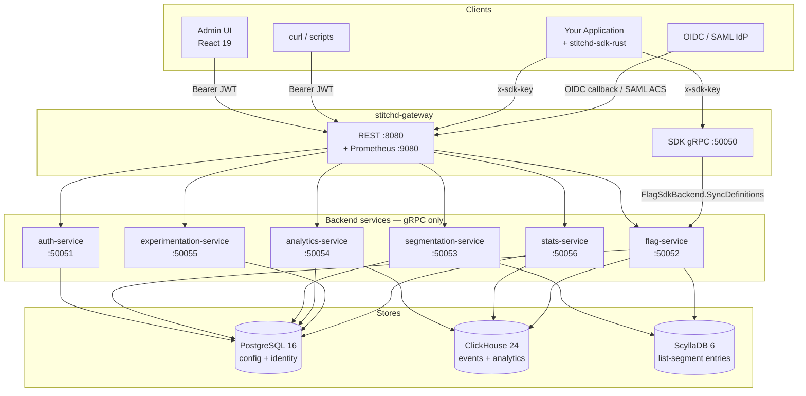

# System Architecture

Stitchd is structured as **six gRPC microservices behind one REST gateway**.
Every external client — admin UI, embedded SDK, curl, IdP — terminates at the
gateway. Backend services are not directly reachable.

## Service Topology

The gateway dispatches over gRPC (tonic 0.14) to backend services. The SDK
also speaks gRPC, but only via the gateway's dedicated `:50050` SDK port —
backend services validate that callers carry the `x-env-id` metadata header
the gateway injects after authenticating the SDK key.

## Crates

| Crate | Type | Listen ports | Role |
|---|---|---|---|
| `stitchd-gateway` | Binary | `:8080` REST (Prometheus served at `GET /metrics` on the same port), `:50050` SDK gRPC | REST entrypoint; translates JSON → gRPC; SDK-facing `SdkService.SyncDefinitions` + `IngestSdkEvalLog`; OpenAPI spec |
| `stitchd-auth-service` | Binary | `:50051` gRPC, `:9091` metrics | `AuthService`, `ManagementService`, `AuthProviderService`, `OidcLoginService`, `SamlLoginService`. Owns `users`, `org_memberships`, `auth_providers`, `refresh_tokens`, `sdk_keys`, the Org/Project/Environment hierarchy |
| `stitchd-flag-service` | Binary | `:50052` gRPC, `:9052` metrics | `FlagService` + `FlagSdkBackendService`. Flag CRUD, variant + rule management, `EvaluatePreview`, whole-flag lock checks, eval-log writes to ClickHouse |
| `stitchd-segmentation-service` | Binary | `:50053` gRPC, `:9053` metrics | `SegmentationService` + `SegmentationSdkBackendService`. Rule-based + list-based membership. ScyllaDB-backed `BatchCheckListMembership`. Background generation sweeper |
| `stitchd-analytics-service` | Binary | `:50054` gRPC, `:9104` metrics | `AnalyticsService` — event-definition + metric-definition CRUD, `TrackEvents`, metric preview, experiment-result reads, context registry |
| `stitchd-experimentation-service` | Binary | `:50055` gRPC, `:9055` metrics | `ExperimentationService` — experiment lifecycle, iterations, results aggregation, ClickHouse `experiment_assignments` reads for the exposures panel |
| `stitchd-stats-service` | Binary | `:50056` gRPC, `:9200` HTTP (health + metrics) | `StatsService` — scheduled stats compute loop, on-demand `TriggerRecompute`, time-series query builder, context registry refresher |
| `stitchd-core` | Library | — | Domain model, rule engine, hashing, ID types, stats math (Frequentist / Bayesian / CUPED / SRM), metric primitives |
| `stitchd-db` | Library | — | sqlx repositories, ClickHouse client wrapper, Scylla session, PG + Scylla migration runners |
| `stitchd-event-writer` | Library | — | ClickHouse event writer + CH migration runner (used by analytics + stats services) |
| `stitchd-proto` | Library | — | Generated tonic stubs for every gRPC service. `build.rs` runs `tonic_prost_build::configure()` against the `proto/` tree |
| `xtask` | Binary | — | `cargo run -p xtask -- docs` builds the mdBook site (protoc-gen-doc + OpenAPI export + mdbook) |

## Design Principles

**Gateway as the trust boundary.** SDK keys and JWTs are validated exactly once
— at the gateway, by `sdk_auth_middleware` (for SDK routes) and
`auth_middleware` (for JWT routes). The gateway then forwards the resolved
`environment_id` to backend services as the `x-env-id` gRPC metadata header.
Backend services trust this and do not re-check. This is enforced in code:
the gateway's `SdkContext` extension is the only producer of `x-env-id`.

**In-process flag evaluation.** SDKs pull the full snapshot of flag + segment
+ event-definition data via `SdkService.SyncDefinitions` (gRPC, polled every
30s by default), then evaluate flags entirely in-memory. The only per-eval
network hop is list-segment membership — and that is batched and LRU-cached.
See [Evaluation Flow](./evaluation-flow.md).

**Three stores, three workloads.** PostgreSQL is the config store and audit
trail (transactional, normalised). ClickHouse holds the event stream, eval
log, and pre-computed experiment results (append-only, columnar). ScyllaDB
holds list-segment entries (wide-row, million-scale per segment). The split
keeps event ingest from competing with flag reads, and lets segment list
membership scale horizontally without touching the OLTP plane. See
[Data Stores](./data-stores.md).

**Server-derived experiment attribution.** SDKs are experiment-unaware. Every
flag evaluation writes a row to `flag_evaluation_log_v2` carrying the
`matched_rule_id` + `targeting_on` columns. A ClickHouse materialized view
(`experiment_assignments_mv`) routes those rows through the
`experiment_iterations_active` dictionary into `experiment_assignments` as
first-exposure (ITT) records. See [Experimentation](../experimentation/index.md).

**Optimistic concurrency on every mutable entity.** Flags, variants, rules,
segments, event_definitions, metric_definitions, experiments, organisations,
projects, environments — all carry a `version BIGINT`. PATCH / PUT requests
carry `expected_version`; sqlx repos enforce `WHERE version = $expected` and
bump on success. Conflicts surface as HTTP `409 Conflict`.

**Soft-delete by default.** All business-critical entities have a `deleted_at
TIMESTAMPTZ`. Live-row uniqueness is enforced by partial unique indexes
(`UNIQUE … WHERE deleted_at IS NULL`) so a soft-deleted name can be reused.

## Further Reading

- [Multi-Tenancy](./multi-tenancy.md) — Organisation / Project / Environment
  hierarchy, RBAC roles, SDK keys, JWTs.
- [Evaluation Flow](./evaluation-flow.md) — SDK polling cadence, in-process
  eval, list-segment batch refresh, eval-log emission.
- [Data Stores](./data-stores.md) — Postgres / ClickHouse / Scylla roles,
  partitioning, the AggregatingMergeTree + ReplacingMergeTree invariants.
- [Events](./events.md) — pre-registered events, multi-context attribution,
  SDK `track()` semantics, per-env quota.
- [Metrics](./metrics.md) — composable Aggregation / Ratio / Funnel
  primitives + ClickHouse preview.
- [Service Flows](./service-flows.md) — cross-service sequence diagrams for
  every common request path.
