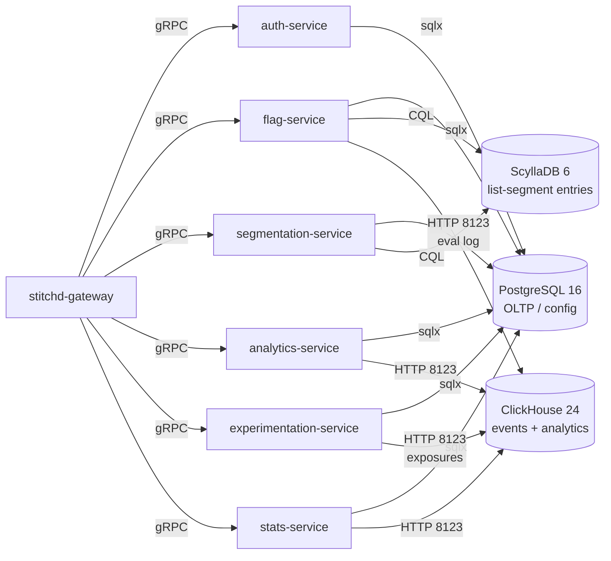
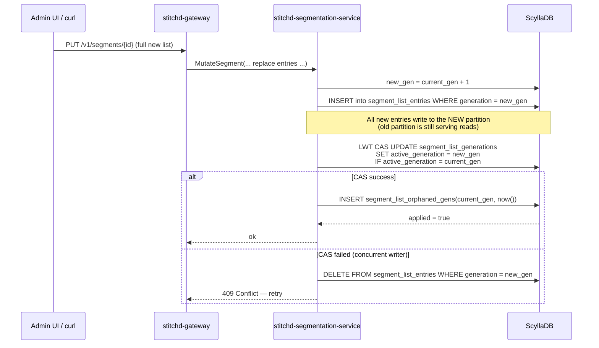

# Data Stores

Stitchd uses **three** data stores with distinct workloads and access
patterns. None of the three is a substitute for either of the others; the
split is intentional.



## PostgreSQL 16+ — Configuration Store

**Workload:** transactional CRUD over normalised tables, with strong
referential integrity and per-row optimistic-concurrency. Reads dominate;
mutations are infrequent but auditable.

**Driver:** `sqlx 0.8` in offline mode (`.sqlx/` snapshots committed for
CI compile-time SQL checks).

### Schema overview

Migrations live in `crates/stitchd-db/migrations/`. Headline tables:

| Domain | Tables |
|---|---|
| Identity & hierarchy | `organisations`, `projects`, `environments`, `users`, `org_memberships`, `user_project_roles`, `user_env_roles`, `auth_providers`, `refresh_tokens`, `invites`, `mfa_challenges`, `mfa_recovery_codes`, `password_reset_otps`, `sdk_keys` |
| Feature flags | `feature_flags`, `variants`, `feature_flag_rules` |
| Segmentation (metadata) | `segments` |
| Events & metrics | `event_definitions`, `metric_definitions` |
| Experiments | `experiments`, `experiment_iterations`, `stats_jobs`, `stats_schedule` |
| Context registry | `context_type_registry`, `context_param_registry` |
| Audit | `audit_log` |

Every mutable entity carries a `version BIGINT` and `deleted_at TIMESTAMPTZ`
for optimistic-concurrency + soft-delete (see [Architecture](./README.md)).
Live-row uniqueness is enforced via partial unique indexes
(`UNIQUE … WHERE deleted_at IS NULL`).

### Performance-critical indexes

Added in `db_optim_20260516` (`crates/stitchd-db/migrations/2026051600000{1-4}_*.sql`):

| Migration | Index | Purpose |
|---|---|---|
| `20260516000001` | `idx_sdk_keys_key_hash_active` | Sub-millisecond SDK key auth (`WHERE key_hash = $1 AND is_active`) |
| `20260516000002` | Six partial indexes `WHERE deleted_at IS NULL` on flags, segments, projects, environments, event_definitions, experiments | Soft-delete query pruning |
| `20260516000003` | `idx_segment_list_entries_covering` (legacy PG list-entries table, now dropped — covering index retained on the stub) | Historical |
| `20260516000004` | `idx_context_type/param_registry_last_seen` | Background purge of stale registry rows |

Production deploys must run `CREATE INDEX CONCURRENTLY` manually outside a
transaction.

### Migration tooling

- **CLI:** `sqlx-cli` (`sqlx migrate run`) against
  `crates/stitchd-db/migrations/`.
- **Embedded:** services call `sqlx::migrate!("../stitchd-db/migrations")
  .run(&pool)` at boot — fresh dev databases pick up everything
  automatically. See e.g. `crates/stitchd-auth-service/src/main.rs`.

## ClickHouse 24+ — Event Stream & Analytics

**Workload:** append-only event ingest at high volume (potentially millions
of events / day / tenant) plus columnar analytical reads (aggregations,
percentiles, time-series).

**Driver:** `clickhouse 0.15` over HTTP (`:8123`). The insert API is
async + generic over `Row` (`#[derive(Row)]` on the writer struct).

**Migration runner:** `stitchd-event-writer` embeds CH migrations from
`crates/stitchd-event-writer/migrations/`. Services call into the runner
during their startup phase.

### Table inventory

| Table | Engine | Notes |
|---|---|---|
| `events_v2` | `MergeTree`, weekly `toMonday(timestamp)` partitions | Canonical event ingest. `contexts Array(Tuple(String, String))` for multi-context attribution; `metric_key LowCardinality(String)`; three nullable typed value cols (`value_bool / value_int / value_double`); `properties Map(String, String)`; `timestamp` + `occurred_at` `DateTime64(3, 'UTC')` |
| `events` | `MergeTree`, monthly partitions | Legacy ingestion table — slated for retirement once `events_v2` is fully cut over |
| `flag_evaluation_log` (a.k.a. `flag_evaluation_log_v2`) | `MergeTree`, weekly `toMonday(evaluated_at)` partitions + 90-day TTL | Eval-log writes. Carries `targeting_on Bool` + `matched_rule_id Nullable(UUID)` columns — both required for experiment attribution |
| `events_experiment_daily` | `AggregatingMergeTree` | Pre-aggregated experiment stats keyed on `(env_id, experiment_id, variant_key, metric_key, day)` |
| `events_experiment_daily_mv` | `MATERIALIZED VIEW TO events_experiment_daily` | Auto-populates the AMT from `events` inserts using `countState() / sumState() / uniqState()` |
| `experiment_assignments` | `ReplacingMergeTree(_version)`, monthly partitions, 180-day TTL | First-exposure (ITT) assignments — see [Attribution](#first-exposure-attribution-replacingmergetree) below |
| `experiment_assignments_mv` | `MATERIALIZED VIEW` | Routes `flag_evaluation_log` rows where `targeting_on = true AND dictHas('experiment_iterations_active', …)` into `experiment_assignments` |
| `experiment_results` | `MergeTree` | Pre-computed per-experiment results; written by `stitchd-stats-service`, read by `stitchd-analytics-service`. PG `experiment_results` was dropped in migration `20260519000001` |
| `metric_definitions` | `ReplicatedReplacingMergeTree(updated_at)` | Mirror of the PG `event_definitions` table for in-CH joins (legacy from earlier metric design — most query paths now resolve metric configs in `stats-service` and pass them down) |

### ClickHouse dictionary

| Dictionary | Source | Key | Use |
|---|---|---|---|
| `experiment_iterations_active` | PG view `public.v_experiment_iterations_active` | `(env_id UUID, flag_id UUID, matched_rule_id Nullable(UUID), context_type String)` | `experiment_assignments_mv` calls `dictGet(...)` to attach `experiment_id` + `iteration_id` to each in-scope eval row. `LIFETIME(MIN 30 MAX 60)` + explicit `SYSTEM RELOAD DICTIONARY` on every iteration start/stop |

The dictionary source uses ClickHouse's `POSTGRESQL(...)` driver — the
`invalidate_query` polls `public.experiment_iterations_active_audit.updated_at`
so the dictionary only re-pulls when the underlying data has changed.

### AggregatingMergeTree invariants

When writing to `events_experiment_daily` (or any other AMT):

- **Insert** uses `*State` combiners: `countState()`, `sumState(Float64)`,
  `uniqState(...)`.
- **Read** uses `*Merge` combiners in a `GROUP BY` — NOT
  `finalizeAggregation` (that one is scalar-only and silently produces
  wrong results when applied row-wise).
- `sumState(Nullable(Float64))` does NOT match the stored type
  `AggregateFunction(sum, Float64)` — always wrap nullable input with
  `ifNull(..., 0.0)` to keep types aligned.

### First-Exposure Attribution (`ReplacingMergeTree`)

`experiment_assignments` solves a subtle problem: a context can re-evaluate
the same flag many times within an iteration, but we want the
**earliest** evaluation to determine the variant (intent-to-treat).

The standard `ReplacingMergeTree(<version>)` keeps the row with the
**maximum** version during merges. We invert this:

```sql
-- excerpt from 20260521000003_experiment_assignments_mv.sql
ENGINE = ReplacingMergeTree(_version)
...
_version = -toUnixTimestamp64Milli(evaluated_at)
```

Negative timestamps mean `MAX(_version) ≡ MIN(evaluated_at)` — the
first-exposure row wins. Readers MUST collapse the unmerged window
explicitly via either `FINAL` or `argMin(...) GROUP BY` (the stats queries
in `crates/stitchd-stats-service/src/queries/` always do; tests force
determinism with `OPTIMIZE TABLE experiment_assignments FINAL`).

### Why ClickHouse and not Postgres for events

| Question | Answer |
|---|---|
| Storage efficiency | Columnar with `LowCardinality` strings + numeric codecs. Per-row storage is a fraction of equivalent PG |
| Partition pruning | Weekly `toMonday()` partitions on `events_v2` and `flag_evaluation_log` keep eval-stats queries (typically < 7 days) scanning only one partition |
| Aggregation speed | `AggregatingMergeTree` + materialised views pre-compute experiment stats; the experiment results read path is `SELECT … finalizeAggregation()` over already-merged states |
| Write isolation | Event ingest never blocks flag config reads — different store, different engine |

### Migration files (post-`events_metrics_20260519` + `experimentation_full_20260521`)

| Migration | Change |
|---|---|
| `20260516000007_events_v2.sql` | Create `events_v2` with weekly partitions + backfill |
| `20260520000001_events_v2_properties.sql` | Add `properties Map(String, String)` + `occurred_at` to `events_v2` |
| `20260521000001_flag_eval_log_matched_rule.sql` | Add `targeting_on Bool` + `matched_rule_id Nullable(UUID)` to `flag_evaluation_log` (MATERIALIZE → MODIFY DEFAULT → DROP `is_disabled`) |
| `20260521000002_experiment_iterations_active_dict.sql` | Create the PG-backed CH dictionary |
| `20260521000003_experiment_assignments_mv.sql` | Create `experiment_assignments` + MV |
| `20260521000004_backfill_experiment_assignments.sql` | One-shot 90-day backfill from `flag_evaluation_log` |
| `20260521000005_experiment_results_context_type.sql` | Add `context_type LowCardinality(String) DEFAULT 'user'` to `experiment_results` for per-context-type stats |

## ScyllaDB 6+ — List-Segment Entry Store

**Workload:** wide-row storage for list-based segment include/exclude
entries, up to millions of keys per segment. Hot path is point membership
checks (`SELECT … WHERE segment_id = ? AND context_type = ? AND
generation = ? AND entry_key = ?`) — exactly what a Cassandra-compatible
store excels at.

**Driver:** `scylla 1.6` async CQL driver with the `metrics` feature
enabled (driver-internal metrics polled every 15s and re-emitted as
Prometheus gauges).

**Keyspace:** `stitchd_segments` (renamed from `stitchd` in
`segment_scylla_20260516`). Replication factor is set at bootstrap from
the environment, not in the schema files.

### Table layout

Four tables under `crates/stitchd-db/scylla-migrations/`:

| Table | Primary Key | Purpose |
|---|---|---|
| `segment_list_entries` | `((segment_id, context_type, generation), list_type, entry_key)` | The actual include/exclude entries. Wide rows partitioned by `(segment_id, context_type, generation)`; clustering on `(list_type, entry_key)` for sorted scans |
| `segment_list_generations` | `(segment_id, context_type)` | Pointer row naming the currently-active generation. One row per `(segment_id, context_type)`, updated via Lightweight Transaction (LWT CAS) for atomic swap |
| `segment_list_summary` | `(segment_id, context_type)` | Counter rows for `include_count` + `exclude_count`. Counters update atomically with each add/remove; the admin UI uses these for the segment-list-row counts without scanning the entries table |
| `segment_list_orphaned_gens` | `(segment_id, context_type, generation)` | Tracks superseded generations awaiting sweep. The background `GenerationSweeper` reads this table, deletes the orphaned partition from `segment_list_entries`, then deletes the row here |

### Atomic full-replace via generation swap



Readers always consult `segment_list_generations` first to find the active
generation, then issue a point read against `segment_list_entries` for the
exact `(segment_id, context_type, generation, list_type, entry_key)`.
Because the LWT atomically flips a single pointer row, there is never a
moment where readers see partial new state.

The sweeper (`crates/stitchd-segmentation-service/src/sweeper.rs::GenerationSweeper`)
runs every `STITCHD_SEGMENTATION_SWEEPER_INTERVAL_SECS` (default 3600s) and
deletes orphaned generations older than
`STITCHD_SEGMENTATION_SWEEPER_RETENTION_SECS` (default 86400s — 24h
retention, so callers reading at the boundary of a swap don't get NULL
results).

### Why ScyllaDB, not PostgreSQL?

The legacy design kept list entries in a PG `segment_list_entries` table
partitioned by `pg_partman`. Two real problems pushed us to Scylla:

1. **Scale.** Million-entry segments are a single CQL partition in
   ScyllaDB. The PG variant required partitioning + heavy index
   maintenance, and add/remove batches blocked on the segment row's
   advisory lock.
2. **Atomic full-replace.** Generation swap via LWT is one round-trip and
   wait-free for readers. The PG variant used `BEGIN; DELETE; INSERT;
   COMMIT;` inside a transaction that blocked reads on the same segment
   row.

The PG `segment_list_entries` table was retired in migration
`20260516000005_drop_segment_list_entries.sql`. PG retains only the
segment metadata (`segments` table — name, type, counts cache).

## Cross-Store Composition

| Question | Where to query |
|---|---|
| "Which variant should this user see?" | In-process SDK eval (data flows from PG → SDK via `SyncDefinitions`) |
| "Is this user in list segment X?" | ScyllaDB via `SegmentationSdkBackendService.BatchCheckListMembership` |
| "What does this flag's rule list look like?" | PostgreSQL — `feature_flag_rules` |
| "How many evaluations of flag F happened last hour?" | ClickHouse `flag_evaluation_log` via `eval_stats` route |
| "What variant did context C land in for experiment X?" | ClickHouse `experiment_assignments` (`FINAL` or `argMin`) |
| "Did experiment X reach significance?" | ClickHouse `experiment_results` (pre-computed by `stats-service`) |
| "Who edited flag F yesterday?" | PostgreSQL `audit_log` |

The `CompositeSegmentRepository` (`crates/stitchd-db/src/repository/composite_segment.rs`)
is a façade that routes membership queries to Scylla and metadata queries
to PG transparently, so service code rarely sees the boundary.
