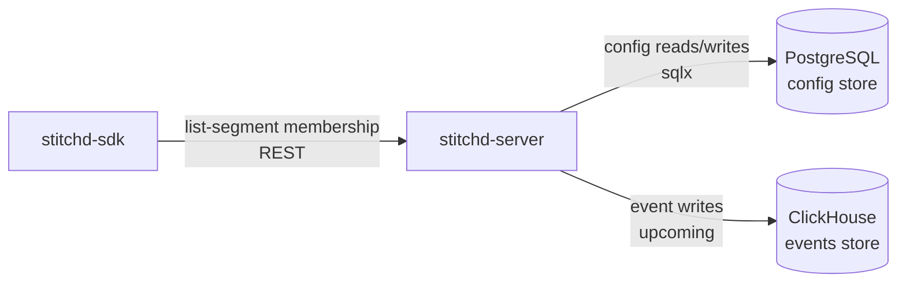

# Data Stores

Stitchd uses two data stores with clearly separated responsibilities. Neither store
substitutes for the other — the split is intentional.

## Overview

## PostgreSQL — Configuration Store

**Role:** Authoritative source of truth for all feature flag configuration.

PostgreSQL is chosen for its ACID guarantees, rich SQL expressiveness, and compatibility
with the standard sqlx connection pool.

| Table Category | Examples |
|----------------|---------|
| Identity | `tenants`, `projects`, `environments`, `sdk_keys` |
| Feature Flags | `feature_flags`, `variants`, `flag_values` |
| Segmentation | `segments`, `segment_rules`, `list_segment_members` |
| Experimentation | `experiments`, `experiment_metrics` |
| Audit | `audit_logs` |

All writes go through `stitchd-db` which enforces tenant isolation via parameterized queries.

**Migration tool:** [sqlx-cli](https://github.com/launchbahq/sqlx) — run `sqlx migrate run` before starting the server.

## ClickHouse — Events Store *(Upcoming)*

**Role:** Append-only event ingestion and analytical aggregations.

ClickHouse is chosen because experiment events are:

- **High-volume** — potentially millions of events per day per tenant
- **Append-only** — events are never updated, only inserted
- **Analytically queried** — aggregations, time-series, percentile calculations

Keeping events in ClickHouse prevents experiment load from competing with flag evaluation
reads in PostgreSQL.

| Data Category | Notes |
|---------------|-------|
| Evaluation events | One row per `(flag, context, variant, timestamp)` |
| Experiment results | Pre-aggregated metric values per experiment arm |
| Telemetry | Optional flag evaluation counts (for dashboards) |

> ClickHouse integration is implemented by `stitchd-events`. The HTTP interface (port 8123)
> is used for writes; native protocol (port 9000) for bulk analytical reads.

## Choosing the Right Store

| Question | Store |
|----------|-------|
| "Which variant should this user see?" | PostgreSQL (via gRPC-synced cache) |
| "Did this experiment reach significance?" | ClickHouse |
| "What rules are configured for this flag?" | PostgreSQL |
| "How many users saw variant A last week?" | ClickHouse |
