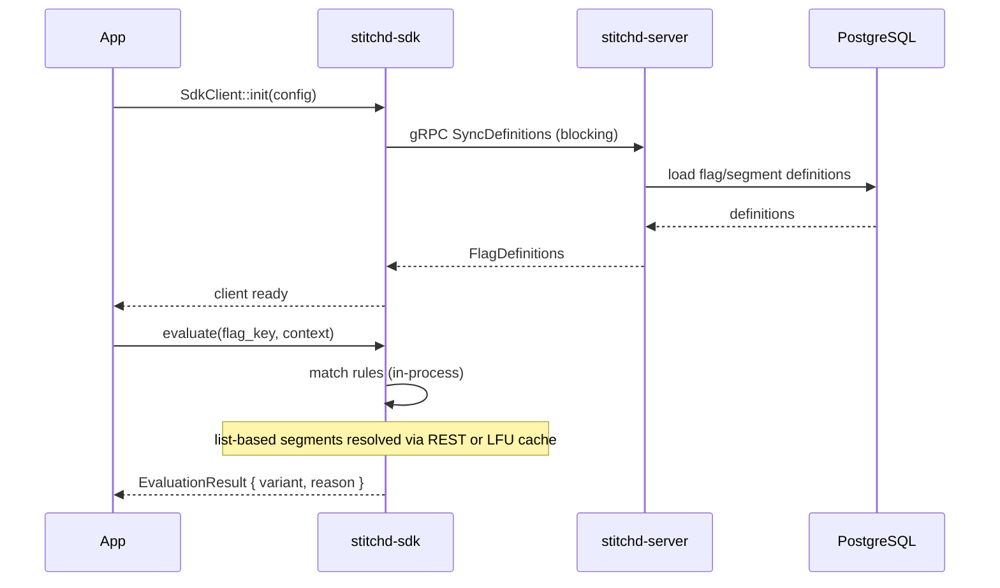

# Flag Evaluation Flow

The SDK evaluates flags in-process after syncing definitions from the server via gRPC.

```mermaid
sequenceDiagram
    participant App
    participant SDK as stitchd-sdk
    participant Server as stitchd-server
    participant PG as PostgreSQL

    App->>SDK: SdkClient::init(config)
    SDK->>Server: gRPC SyncDefinitions (blocking)
    Server->>PG: load flag/segment definitions
    PG-->>Server: definitions
    Server-->>SDK: FlagDefinitions
    SDK-->>App: client ready

    App->>SDK: evaluate(flag_key, context)
    SDK->>SDK: match rules (in-process)
    Note over SDK: list-based segments resolved via REST or LFU cache
    SDK-->>App: EvaluationResult { variant, reason }
```
