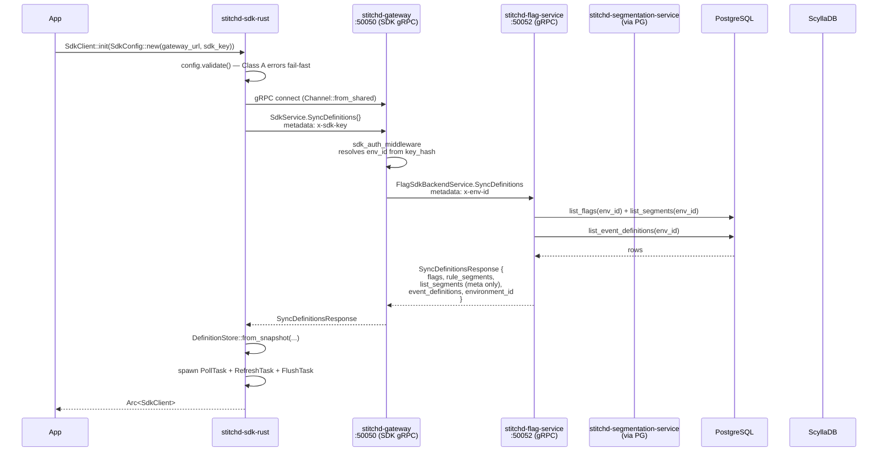

# Flag Evaluation Flow

Stitchd evaluates feature flags **in-process** inside the application that
embeds the SDK. The SDK pulls a full snapshot of flag + segment +
event-definition data via gRPC polling, then runs the rule engine locally
against the caller-supplied `EvaluationContext`. The only per-eval network
hop is list-segment membership — and that is batched and LRU-cached.

There is also a server-side evaluation path used by the admin UI's "Test"
panel (`POST /v1/projects/{project_id}/flags/{flag_id}/evaluate-preview`),
which runs the same rule engine on `flag-service` using its in-memory cache.
It exists for admin debugging only; production traffic uses the in-process
SDK path.

## Startup — First Definition Sync

The SDK's `SdkClient::init` is fail-fast: it does not return until either
the first `SyncDefinitions` call succeeds or it returns an error.



Three background tasks are spawned on success:

| Task | Cadence | Purpose |
|---|---|---|
| `PollTask` | `definition_poll_interval` (default 30s, exponential backoff on failure: 1×, 2×, 4×, capped at 5×) | Periodic `SyncDefinitions` refresh, atomically swaps the `DefinitionStore` snapshot |
| `RefreshTask` | `list_segment_refresh_interval` (default 60s) | Batch-refreshes membership for every key currently resident in the LRU via `POST /v1/sdk/segments/list:batch` |
| `FlushTask` | `event_flush_interval` (default 5s) OR when `event_batch_size` is hit (default 100) | Drains the bounded queue of `FlagEvaluationEvent`s to `POST /v1/sdk/events:batch` |

Note: list-segment metadata in the snapshot is just `(id, key, context_type)`
— **not** the entries. Entries live in ScyllaDB and are fetched on demand
(see [List-Segment Path](#list-segment-path)). This keeps the snapshot
payload small even when individual segments contain millions of keys.

## Per-Request Evaluation

```mermaid
sequenceDiagram
    participant App
    participant SDK as stitchd-sdk-rust
    participant LRU as MembershipCache
    participant GW as stitchd-gateway :8080
    participant SEG as stitchd-segmentation-service

    App->>SDK: client.evaluate(&[EvalRequest { flag_key, context }])
    SDK->>SDK: load DefinitionSnapshot (lock-free read)
    SDK->>SDK: find FeatureFlag by key

    alt flag not found
        SDK-->>App: EvalResult { outcome: FlagNotFound, default-for-type }
    else flag disabled (enabled = false)
        SDK-->>App: EvalResult { outcome: Disabled, default-variant }
    else custom rule matches
        SDK->>SDK: walk rules; first match wins
        opt rule references a list-segment
            SDK->>LRU: get(context_type, context_key)
            alt LRU hit
                LRU-->>SDK: memberships map
            else LRU miss
                SDK->>GW: POST /v1/sdk/segments/list:batch
                GW->>SEG: SegmentationSdkBackendService<br/>.BatchCheckListMembership
                SEG-->>GW: MembershipResult[]
                GW-->>SDK: results
                SDK->>LRU: put(...)
            end
        end
        SDK->>SDK: resolve output (variant_key OR PercentageAllocation)
        SDK-->>App: EvalResult { outcome: Matched, variant }
    else default rule (no custom rule matched)
        SDK->>SDK: resolve default_rule_distribution (if any)<br/>or default_variant
        SDK-->>App: EvalResult { outcome: DefaultRule, variant }
    end

    SDK-)SDK: enqueue FlagEvaluationEvent (fire-and-forget)
```

Evaluation never awaits on the event queue — `enqueue` is non-blocking and
drops the oldest event when the buffer is full (`event_buffer_capacity`,
default 1000). Back-pressuring `evaluate()` would defeat the purpose of an
in-process SDK.

## Rule Engine

Rules are evaluated as a `ConditionExpr` tree of:

| Variant | Semantics |
|---|---|
| `And(Vec<ConditionExpr>)` | All children must match. Missing context resolves to `false` |
| `Or(Vec<ConditionExpr>)` | Any child must match. Missing context across all children resolves to `false` |
| `Not(Box<ConditionExpr>)` | Negation |
| `Leaf { attribute, operator, value }` | Compare a context attribute (`context_type.parameter_name`) against a literal |
| `IsInSegment { segment_id }` | Membership check — rule-based segment (eval locally) OR list-based (LRU-cached lookup) |
| `FlagEvaluatedWith { flag_key, variant_key }` | Cross-flag predicate — recursively evaluates the referenced flag with the same context |

`ConditionExpr` operators include the standard comparators (`==`, `!=`,
`<`, `<=`, `>`, `>=`), set operators (`in`, `not_in`), substring (`contains`,
`starts_with`, `ends_with`), regex, and the SemVer comparators (`semver_eq`,
`semver_lt`, …). Numeric values are coerced through `ParameterValue` so an
`int` context attribute compares cleanly against a `double` literal.

The rule engine lives in `stitchd-core::rules` and is shared verbatim
between the SDK and `flag-service` (server-side preview). The exact same
function evaluates a flag whether you hit the in-process path or the
preview endpoint — there is no second implementation that could drift.

## Percentage Allocation

When a rule's output is `PercentageAllocation` (rather than a fixed
`variant_key`), the SDK computes a deterministic hash:

```text
hash_input = [context_key for type in context_hash_specs.keys()]
           + [parameter_value for (type, param) in context_hash_specs]
           + flag_key + project_id + environment_id
bucket = hash(hash_input) mod 100_000
```

`100_000` gives 0.1% bucket granularity. `AllocationBucket.weight_milli`
sums to `1000 * 100 = 100_000` across all buckets for a flag — the first
bucket whose cumulative weight contains the computed `bucket` wins.

Three hash families are supported (configurable per flag via
`UpdateFlagHashing`):

| Family | Crate | Default? |
|---|---|---|
| `siphasher::sip::SipHasher24` | `siphasher 1.0` | yes |
| `murmur3::murmur3_x64_128` | `murmur3 0.5` | opt-in |
| `sha2::Sha256` | `sha2 0.11` | opt-in |

The hash inputs are deterministic across SDKs and across services — the
server-side `EvaluatePreview` path computes the same buckets as the SDK.

## List-Segment Path

List-segment metadata in the SDK snapshot is just
`{id, key, context_type}` per segment. To resolve membership the SDK
issues one batched REST call:

```http
POST /v1/sdk/segments/list:batch HTTP/1.1
Host: gateway:8080
x-sdk-key: sdk_live_…
Content-Type: application/json

{
  "queries": [
    { "context_type": "user", "context_key": "alice",
      "segment_ids": ["d3b0…", "f4a8…"] }
  ]
}
```

The gateway forwards to `SegmentationSdkBackendService.BatchCheckListMembership`
on `:50053`, which runs a single CQL query against ScyllaDB and returns one
`MembershipResult` per query:

```json
{
  "results": [
    {
      "context_type": "user",
      "context_key": "alice",
      "memberships": {
        "d3b0...": true,
        "f4a8...": false
      }
    }
  ]
}
```

The SDK populates the LRU with the full `(context_type, context_key) →
memberships` map so subsequent evaluations against any list segment in
that map are cache hits. The background `RefreshTask` re-fetches the same
keys every `list_segment_refresh_interval` to keep stale entries fresh.

## Event Emission

Each `evaluate()` call enqueues a `FlagEvaluationEvent` carrying the
following wire shape (also defined in `sdks/spec/proto/sdk/v1/service.proto`):

| Field | Notes |
|---|---|
| `flag_key`, `flag_id` | The flag identifier. `flag_id` is the UUID from the snapshot — never re-resolved by the backend |
| `variant_key` | The variant the SDK returned |
| `context_type`, `context_key` | The evaluation unit |
| `evaluated_at` | RFC3339 UTC, ms precision — SDK local clock |
| `matched_rule_id` | UUID of the rule that matched; empty for `default_rule` / `disabled` / `flag_not_found` |
| `outcome` | `matched` / `default_rule` / `disabled` / `flag_not_found` |
| `reasoning_included` | True when the caller used `evaluate_with_reasoning` |
| `context_parameters` | Subset of context params; entries listed in `privateParameters` are omitted |

The gateway's `POST /v1/sdk/events:batch` handler forwards the batch via
`FlagSdkBackendService.IngestSdkEvalLog` to `flag-service`, which routes
through the eval-log writer pipeline into ClickHouse
`flag_evaluation_log_v2`. The eval log is then the input side of the
[experiment attribution pipeline](../experimentation/attribution.md).

## Server-Side Preview

The admin UI's "Test" panel uses `POST
/v1/projects/{project_id}/flags/{flag_id}/evaluate-preview` instead of the
SDK path. This route:

1. Forwards to `FlagService.EvaluatePreview` (gRPC).
2. `flag-service` runs the SAME `stitchd-core::rules` engine against a
   user-supplied mock context.
3. Returns the matched variant **plus** a full rule trace (which rule
   matched, why; which leaf evaluated to which value; rollout debug info
   showing the computed hash bucket).

`EvaluatePreview` is read-only and does not write to the eval log —
preview calls are not experiment exposures.

## Failure Modes

| Failure | SDK behaviour |
|---|---|
| Gateway unreachable on startup | `SdkClient::init` returns `SdkError::Network`. Application must handle (retry or fail-fast — your call) |
| Gateway unreachable mid-flight | `PollTask` backs off (1× → 5×); evaluations keep serving the **last-known snapshot**. No silent staleness — `metrics::counter!("sdk_poll_failures_total")` increments |
| `BatchCheckListMembership` 5xx / timeout | List-segment leaf evaluates to `false` for this request; LRU is unchanged. Next poll cycle will retry |
| Event flush fails | Batch is retried up to 3× with exponential backoff (200ms / 400ms / 800ms). After that the batch is dropped and a `tracing::warn!` records the count |
| Event buffer full | Oldest event is dropped. `evaluate()` is NEVER awaited — back-pressure on the hot path is disallowed by design |

## Implementation References

| Concern | Source |
|---|---|
| SDK polling loop | `sdks/rust/src/polling.rs::PollTask` |
| LRU refresh | `sdks/rust/src/refresh.rs::RefreshTask` |
| In-process eval | `sdks/rust/src/client.rs::SdkClient::evaluate` + `evaluate_inner` |
| Rule engine | `crates/stitchd-core/src/rules/` |
| Hash families | `crates/stitchd-core/src/hashing/` |
| Gateway SDK gRPC server | `crates/stitchd-gateway/src/grpc_server.rs` |
| Backend RPC | `crates/stitchd-flag-service/src/sdk_backend.rs::FlagSdkBackendServiceImpl` |
| Eval log writer | `crates/stitchd-event-writer/src/eval_log_writer.rs` |
| Server-side preview | `crates/stitchd-flag-service/src/service.rs::evaluate_preview` |
