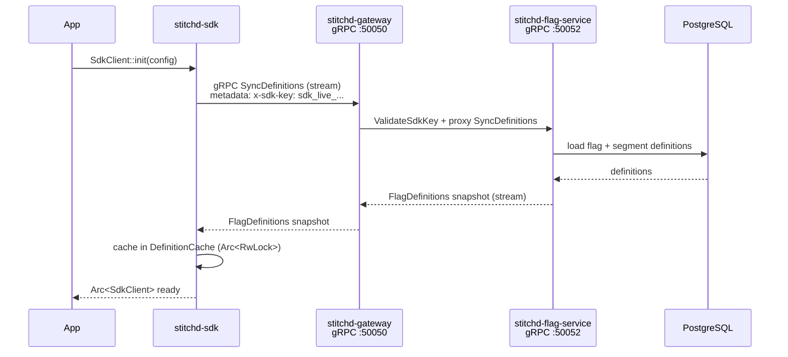
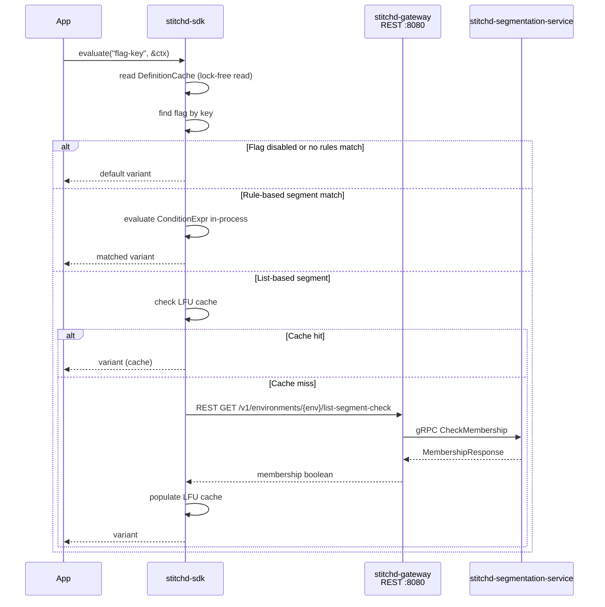

# Flag Evaluation Flow

The SDK evaluates flags **in-process** after syncing definitions from the server via gRPC.
The only network calls after startup are for list-based segment membership checks.

## Startup Sync

After `init`, the SDK holds a complete copy of all flag definitions in memory. The gRPC
stream remains open and `flag-service` pushes incremental updates whenever a flag or
segment changes — no polling interval.

## Per-Request Evaluation

## Rule Engine

Rules are evaluated as a `ConditionExpr` tree:

- **`And(Vec<ConditionExpr>)`** — all children must match
- **`Or(Vec<ConditionExpr>)`** — any child must match
- **`Not(Box<ConditionExpr>)`** — negation
- **`Leaf { field, operator, value }`** — compare a context attribute

Context attributes are looked up from the `EvaluationContext` passed to `evaluate()`.
The context contains typed `ParameterValue` entries (string, int, float, bool, list)
keyed by `(context_type, attribute_name)`.

## LFU Cache

List-segment membership results are cached using an LFU (Least Frequently Used) eviction
policy. Pre-warming a set of high-traffic contexts at startup avoids REST round-trips for
known users. Cache size is configured in `LfuConfig`.
