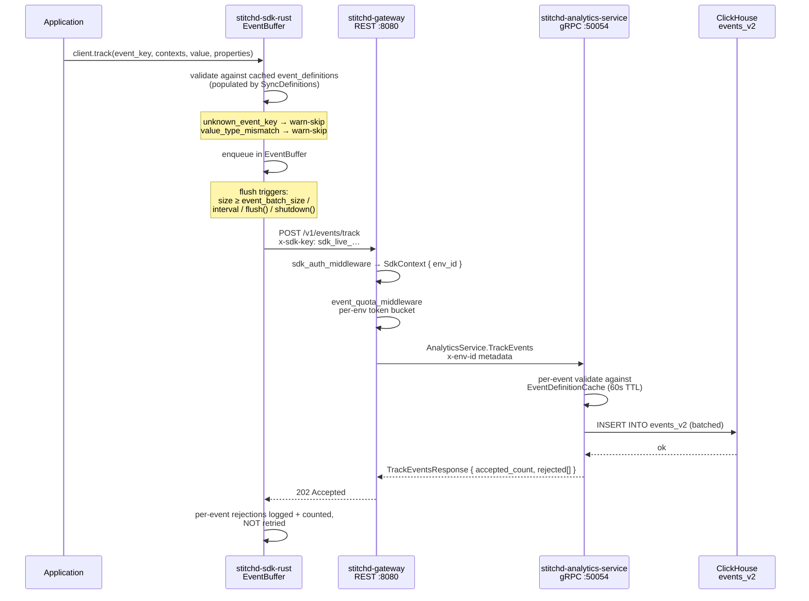

# Events

Events are the ingestion path that feeds ClickHouse from application code.
They are the substrate for every experimentation metric: without registered
event definitions and inbound firings, the metrics layer has nothing to
aggregate.

This page covers the post-`events_metrics_20260519` design.

## Event Definitions

Events are **pre-registered, env-scoped, typed, and metric-classified**.
An attempted firing whose `event_key` is not in `event_definitions` is
rejected at ingestion — this gives downstream metric configuration a
strict schema to lock onto.

```sql
-- crates/stitchd-db/migrations/20260419000001_event_definitions.sql
-- + 20260520000004_event_definitions_admin_fields.sql
CREATE TABLE event_definitions (
    id              UUID        PRIMARY KEY DEFAULT gen_random_uuid(),
    environment_id  UUID        NOT NULL REFERENCES environments(id),
    key             TEXT        NOT NULL,
    value_type      TEXT        NOT NULL CHECK (value_type IN ('bool', 'int', 'double')),
    name            TEXT,
    description     TEXT,
    metric_type     TEXT        NOT NULL DEFAULT 'count'
                    CHECK (metric_type IN ('count', 'conversion', 'revenue',
                                           'duration', 'numeric', 'custom')),
    schema          JSONB,
    version         BIGINT      NOT NULL DEFAULT 1,
    created_at      TIMESTAMPTZ NOT NULL DEFAULT now(),
    updated_at      TIMESTAMPTZ NOT NULL DEFAULT now(),
    deleted_at      TIMESTAMPTZ,
    UNIQUE (key, environment_id)
);

CREATE INDEX idx_event_definitions_env_metric_type_live
    ON event_definitions(environment_id, metric_type)
    WHERE deleted_at IS NULL;
```

| Column | Notes |
|---|---|
| `key` | Immutable. The wire ID — what SDKs send in `event_key` |
| `value_type` | Determines which of the three nullable typed value columns (`value_bool` / `value_int` / `value_double`) the row will populate |
| `metric_type` | Admin classifier surfaced in the UI and the experiment-metric picker. `count` = occurrence marker; `conversion` = bool; `revenue` / `duration` / `numeric` = numeric value; `custom` = free-form payload validated by the optional `schema` |
| `schema` | Optional JSON Schema for the event `properties` payload. Validated server-side on ingest. Lets you require e.g. `currency ∈ {USD, EUR, GBP}` for `purchase` events |
| `version` | Optimistic-locking counter for PATCH/DELETE |
| `deleted_at` | Soft-delete; archived events reject new firings with `410 Gone` while ClickHouse history remains queryable |

The `name` column defaults to `key` when null (backfilled by the migration)
so the admin UI can render `name ?? key` without falling back to empty
cells.

Admin CRUD lives at `/v1/events*` on the gateway, backed by
`AnalyticsService.{Create,Get,List,Update,Delete}EventDefinition` and the
`EventDefinitionRepository` in `stitchd-db`. The admin UI's EventDetail
page additionally calls `GetEventFirings` + `GetEventStats` (ClickHouse
reads) to render recent firings + 14-day sparklines.

## Ingestion Path



### Auth & quota

`POST /v1/events/track` lives on the **SDK-auth tier** (NOT JWT) and sits
behind two layered middlewares:

1. **`sdk_auth_middleware`** — hashes the `x-sdk-key` header (SHA-256 →
   hex), looks it up in `sdk_keys`, calls `AuthService.ValidateCredential`,
   and writes the resolved `SdkContext { environment_id, organisation_id,
   sdk_key_id }` to request extensions. The gateway then forwards
   `environment_id` to the analytics-service as `x-env-id` gRPC metadata
   — the SDK key itself never crosses the internal boundary.

2. **`event_quota_middleware`** — token-bucket rate limit keyed on
   `env_id`. Default 1000 events/sec/env, configurable via
   `STITCHD_EVENT_QUOTA_PER_SEC`. Backed by `governor::DefaultKeyedRateLimiter`
   with a `DashMap`-backed keyed state store for lock-free per-key access.
   The limiter is in-memory **per gateway pod** — horizontal scale-out
   multiplies the effective ceiling by the pod count.

Body size is capped at 5 MiB (`TRACK_EVENTS_BODY_LIMIT_BYTES`) by an
`axum::extract::DefaultBodyLimit` layer attached only to this route — the
rest of the SDK tier continues to use axum's default. Oversized requests
return `413 Payload Too Large`.

### Admin test-event path

The admin UI's EventDetail page has a "Test event" widget that needs to
fire events without an SDK key (the admin session has a JWT, not
`x-sdk-key`). The parallel `POST /v1/admin/events/track` route handles
this — JWT-authenticated, stamps `properties["_test"] = "true"` on every
event before forwarding to analytics-service, and skips the per-env quota
(admin actions are rare and don't need rate limiting).

### Per-event rejections vs. transport failures

The handler returns `202 Accepted` for any batch that reached the
analytics service, even if individual events were rejected. The response
body includes a `rejected[]` array with one entry per failed event:

```json
{
  "accepted_count": 4,
  "rejected": [
    { "event_key": "ghost",     "reason": "unknown_event_key"     },
    { "event_key": "purchase",  "reason": "value_type_mismatch"   },
    { "event_key": "signup",    "reason": "archived_event_key"    },
    { "event_key": "duration",  "reason": "missing_value"         },
    { "event_key": "purchase",  "reason": "invalid_occurred_at"   },
    { "event_key": "click",     "reason": "missing_contexts"      }
  ]
}
```

Six `reason` discriminators are emitted by analytics-service:
`unknown_event_key`, `archived_event_key`, `value_type_mismatch`,
`missing_value`, `invalid_occurred_at`, `missing_contexts`. The
`missing_contexts` reject fires when the firing's `contexts` map is empty —
at least one attribution dimension is required.

The SDK treats per-event rejections as **permanent** — these events are
counted in `FlushReport.rejected` and **not** retried. Transport-level
failures (5xx, network errors) trigger up to 3 retries with exponential
backoff (200ms → 400ms → 800ms by default); after that the whole batch is
dropped and a `tracing::warn!` records the count.

## Multi-Context Attribution

Each firing carries a flat `contexts: { type: key, ... }` map so a single
event can be attributed to multiple dimensions simultaneously without
inflating count metrics. The wire shape from the REST DTO
(`TrackEvent.contexts: HashMap<String, String>`):

```json
{
  "event_key": "purchase",
  "contexts": {
    "user":    "u-42",
    "account": "acme_corp",
    "session": "s-99"
  },
  "value": { "double": 49.95 },
  "properties": { "currency": "USD", "channel": "web" },
  "occurred_at": "2026-05-22T13:14:15.678Z"
}
```

This stores in ClickHouse `events_v2` as:

```text
contexts = [('user', 'u-42'), ('account', 'acme_corp'), ('session', 's-99')]
```

— a single `Array(Tuple(String, String))` column. The
`experiment_assignments_mv` and `events_experiment_daily_mv` join on
`arrayExists(t -> t.1 = '<context_type>' AND t.2 = '<context_key>',
contexts)` so any context dimension can be the unit of analysis without
the event being duplicated.

## ClickHouse Schema

```sql
-- crates/stitchd-event-writer/migrations/20260516000007_events_v2.sql
-- + 20260520000001_events_v2_properties.sql
CREATE TABLE events_v2 (
    env_id        UUID,
    contexts      Array(Tuple(String, String)),
    metric_key    LowCardinality(String),     -- the event_key
    value_bool    Nullable(Bool),
    value_int     Nullable(Int64),
    value_double  Nullable(Float64),
    properties    Map(String, String),
    timestamp     DateTime64(3, 'UTC'),       -- broker/ingestion clock
    occurred_at   DateTime64(3, 'UTC'),       -- client wall-clock (optional)
    ingested_at   DateTime64(3, 'UTC') DEFAULT now64()
)
ENGINE = MergeTree()
PARTITION BY toMonday(timestamp)
ORDER BY (env_id, metric_key, timestamp);
```

Why this shape:

| Choice | Rationale |
|---|---|
| Weekly `toMonday()` partitions | Short eval-stats time ranges (1–7 days) scan a single partition |
| `LowCardinality(String) metric_key` | Few distinct event keys per env (10²–10³); LC encoding gives ~10× compression and faster grouping |
| Three nullable typed value columns | Sparse — only one is populated per row, matching the registered `value_type`. Avoids JSON / variant overhead while keeping each row narrow |
| `properties Map(String, String)` | Arbitrary per-event metadata for JsonLogic `where_clause` filters and `on_field` aggregations |
| `occurred_at` separate from `timestamp` | Lets the SDK submit events with real client-side wall-clock when buffering or replaying offline data; metric queries use `occurred_at` for ITT comparisons against `experiment_assignments.assigned_at` |

## Rust SDK firing

The SDK's `Client::track()` enqueues events on a per-client `EventBuffer`
(a `tokio::sync::Mutex<VecDeque<BufferedEvent>>` behind an `Arc`). The
buffer flushes on four triggers:

| Trigger | Default | Notes |
|---|---|---|
| Size threshold | `event_batch_size = 100` | Crossing the threshold spawns an immediate-flush task (fire-and-forget); `track()` never awaits |
| Time interval | `event_flush_interval = 5s` | Background `tokio::spawn` loop; cancelled on `shutdown()` |
| Explicit `flush().await` | — | Caller awaits a full drain + POST round-trip |
| `shutdown(timeout).await` | 5s default | Aborts the interval task then does one bounded final flush |

Client-side validation happens **before enqueue**: the SDK keeps a cached
copy of `event_definitions` populated by the same polling cycle that
syncs flag/segment definitions (`SyncDefinitionsResponse.event_definitions`).
Unknown keys and `value_type` mismatches are dropped with a
`tracing::warn!` and never reach the gateway. A synchronous helper,
`Client::is_event_registered(key)`, lets application code pre-flight an
event without enqueueing it.

```rust
use stitchd_sdk_rust::{SdkClient, TypedValue};
use std::collections::HashMap;

// Fire a purchase event with multi-context attribution + properties.
let report = client
    .track("purchase", contexts_for_user("u-42", "acme_corp"),
           Some(TypedValue::Double(49.95)),
           Some(HashMap::from([
               ("currency".into(), "USD".into()),
               ("channel".into(),  "web".into()),
           ])))
    .await?;
```

## Related

- [Service Coordination Flows — Event Ingestion](./service-flows.md) — the
  shorter, cross-service sequence diagram.
- [Metrics](./metrics.md) — what consumes the events written here.
- [Data Stores — ClickHouse](./data-stores.md) — partitioning + MV layout
  that the per-kind builders read from.
- `crates/stitchd-gateway/src/routes/events.rs` — the gateway handlers.
- `crates/stitchd-analytics-service/src/grpc/ingestion.rs` — the
  validation + write logic, including the per-env `EventDefinitionCache`.
