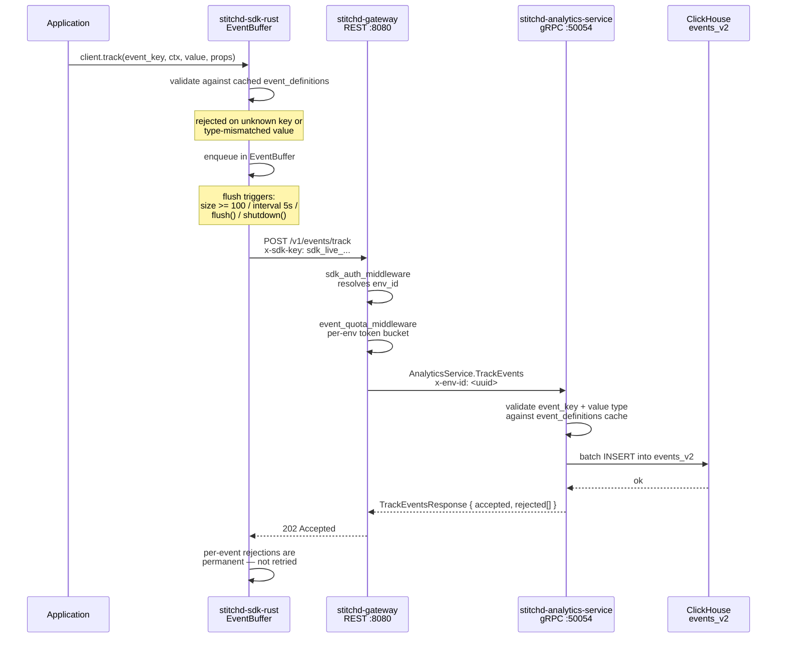

# Events

The events module is the ingestion path that feeds ClickHouse from
application code. It backs every experimentation metric — without registered
event definitions and inbound firings, the metrics layer has nothing to
aggregate.

## Event Definitions

Events are **pre-registered, env-scoped, and typed**. An attempted firing
whose `event_key` is not in `event_definitions` is rejected at ingestion;
this is the equivalent of a strict schema for the analytics pipeline and
makes downstream metric configuration safe.

| Column | Notes |
|--------|-------|
| `id` | UUID primary key |
| `environment_id` | FK → `environments(id)` |
| `key` | event key (immutable, env-unique among live rows) |
| `name`, `description` | human-readable metadata |
| `metric_type` | `count` \| `numeric` \| `boolean` — drives `value` validation |
| `schema` | optional JSON schema for the `properties` payload |
| `version` | optimistic-locking counter |
| `created_at`, `updated_at`, `deleted_at` | soft-delete via `deleted_at` |

A partial UNIQUE index on `(environment_id, key) WHERE deleted_at IS NULL`
allows soft-deleted events to be recreated under the same key. Admin CRUD
is exposed via `/v1/events/*` REST routes on the gateway, backed by the
`EventDefinitionRepository` in `stitchd-db`.

## Ingestion Path



### Auth & quota

`POST /v1/events/track` sits behind two gateway middlewares:

1. **`sdk_auth_middleware`** — hashes the `x-sdk-key` header (SHA-256 →
   hex), looks it up in `sdk_keys`, and writes the resolved `env_id` onto
   the request extensions. The gateway then forwards it to the
   analytics-service as `x-env-id` gRPC metadata (the SDK key itself
   never crosses the internal boundary).
2. **`event_quota_middleware`** — token-bucket rate limit keyed on
   `env_id`. Default 1000 events/sec/env, configurable via
   `STITCHD_EVENT_QUOTA_PER_SEC`. Backed by `governor` with a
   `DashMap`-backed keyed state store for lock-free per-key access. The
   limiter is in-memory per gateway pod — horizontal scale-out multiplies
   the effective ceiling by the pod count.

Body size is capped at 5 MiB by an axum `DefaultBodyLimit` layer (≈ 25k
tiny events per batch); larger requests get `413 Payload Too Large`.

### Per-event rejections vs. transport failures

The handler returns `202 Accepted` for any batch that reached the analytics
service, even if individual events were rejected. The response body
includes a `rejected[]` array with one entry per failed event:

```json
{ "accepted_count": 4,
  "rejected": [
    { "index": 2, "event_key": "ghost", "reason": "unknown_event_key" }
  ] }
```

The SDK treats per-event rejections as **permanent** — these events are
counted in `FlushReport.rejected` and **not** retried. Transport-level
failures (5xx, network errors) trigger up to 3 retries with exponential
backoff (200ms → 400ms → 800ms by default); after that the whole batch is
dropped and a `tracing::warn!` records the drop count.

## Rust SDK Firing

The SDK's `Client::track()` enqueues events on a per-client `EventBuffer`
(a `tokio::sync::Mutex<VecDeque<Event>>` behind an `Arc`). The buffer
flushes on four triggers:

| Trigger | Default | Notes |
|---------|---------|-------|
| Size threshold | 100 events | Configurable via `EventBufferConfig::flush_at_size`. Crossing the threshold spawns an immediate-flush task (fire-and-forget); `track()` never awaits. |
| Time interval | 5 s | Background `tokio::spawn` loop; cancelled on `shutdown()`. |
| Explicit `flush().await` | — | Caller awaits a full drain + POST round-trip. |
| `shutdown(timeout).await` | 5 s timeout | Aborts the interval task then does one bounded final flush. |

Client-side validation happens **before enqueue**: the SDK keeps a cached
copy of `event_definitions` (populated by the same polling cycle that
syncs flag/segment definitions — see
[`feature-flag-7an.5.6`](https://github.com/stitchd-dev/feature-flag/issues)
for the current extension status). Unknown keys and type-mismatched
values are dropped with a `tracing::warn!` and never reach the gateway.
A synchronous helper, `Client::is_event_registered(key)`, lets application
code pre-flight an event without enqueueing it.

## Known Gaps

| Bug | Description |
|-----|-------------|
| `feature-flag-uz3` | `EventDetail` UI calls `GET /v1/events/{key}/firings` + `/stats` for the recent-firings table and 14-day sparkline. The handlers don't exist yet; the UI ships graceful empty/dash states. |
| `feature-flag-gda` | The test-event widget in `EventDetail` requires `POST /v1/events/track` to accept an admin JWT (currently SDK-key only). Pending a parallel admin-auth path or a JWT bypass. |
| `feature-flag-7an.5.6` | The SDK polling layer needs to fetch `event_definitions` alongside flags so the cache isn't empty at startup. Until this lands, `track()` warns and skips every event in clients that have not manually seeded the cache. |

## Related

- [Service Coordination Flows — Event Ingestion](./service-flows.md) — the
  shorter, top-level sequence diagram.
- [Metrics](./metrics.md) — what consumes the events written by this path.
- [Data Stores](./data-stores.md) — why event volume goes to ClickHouse
  rather than PostgreSQL.
