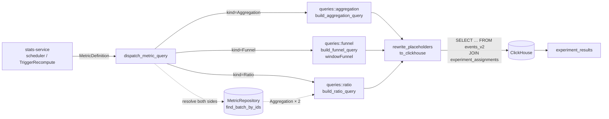

# Metrics

Metrics are the composable layer between raw event rows and statistical
results. Experiments target one or more `metric_definitions` via
`metric_ids[]` (cutover from the original `event_key[]` in migration
`20260520000002_experiment_metrics_cutover.sql`).

This page describes the metric-definitions primitives introduced in
`events_metrics_20260519`.

## Concept

A **metric definition** is an env-scoped, kind-discriminated SQL recipe.
Three kinds:

| Kind | Config | Builder |
|---|---|---|
| **Aggregation** | `{ event_key, aggregator: count\|sum\|avg\|p50\|p90\|p99\|uniq, on_field?, where_clause? (JsonLogic) }` | `queries/aggregation.rs::build_aggregation_query` |
| **Ratio** | `{ numerator_metric_id, denominator_metric_id, min_denominator }` — both sides MUST resolve to Aggregations | `queries/ratio.rs::build_ratio_query` |
| **Funnel** | `{ steps: [{ event_key, where_clause? }], window_seconds, count_repeats }` | `queries/funnel.rs::build_funnel_query` (`windowFunnel`) |

`AggregationConfig.on_field` defaults to the canonical numeric column
(`value_int` / `value_double` chosen by aggregator) but may also point at
a `properties[<key>]` access for per-row numeric metadata.

`where_clause` is a JsonLogic expression — translated to ClickHouse SQL by
the shared `jsonlogic_to_sql` helper — that filters on `events_v2.properties
Map(String, String)` entries. For example: `{ "==": [{"var":
"properties.currency"}, "USD"] }`.

Each kind has a `validate()` method enforcing shape invariants (funnel has
≥2 steps, ratio numerator/denominator distinct, sum/avg require `on_field`,
…). Cross-metric references in `Ratio` are NOT enforced by PG foreign keys;
integrity is checked at **compute time** by the dispatcher (below).

`goal_direction` is one of `increase` / `decrease` / `neutral` and drives:

- the up/down arrow rendered in the metric list,
- experiment winning-variant logic (which direction counts as "better"),
- guardrail direction-violation detection
  (`pre_period_days` + `guardrail_metric_ids` on experiments).

## Storage

```sql
-- crates/stitchd-db/migrations/20260520000001_metric_definitions.sql
CREATE TABLE metric_definitions (
    id              UUID         PRIMARY KEY DEFAULT gen_random_uuid(),
    environment_id  UUID         NOT NULL REFERENCES environments(id),
    key             TEXT         NOT NULL,
    name            TEXT         NOT NULL,
    description     TEXT,
    kind            TEXT         NOT NULL
                    CHECK (kind IN ('aggregation', 'ratio', 'funnel')),
    config          JSONB        NOT NULL,
    goal_direction  TEXT         NOT NULL DEFAULT 'increase'
                    CHECK (goal_direction IN ('increase', 'decrease', 'neutral')),
    version         BIGINT       NOT NULL DEFAULT 1,
    created_at      TIMESTAMPTZ  NOT NULL DEFAULT now(),
    updated_at      TIMESTAMPTZ  NOT NULL DEFAULT now(),
    deleted_at      TIMESTAMPTZ
);

CREATE UNIQUE INDEX idx_metric_definitions_env_key_live
    ON metric_definitions(environment_id, key)
    WHERE deleted_at IS NULL;

CREATE INDEX idx_metric_definitions_environment_id_live
    ON metric_definitions(environment_id)
    WHERE deleted_at IS NULL;

CREATE INDEX idx_metric_definitions_kind
    ON metric_definitions(environment_id, kind)
    WHERE deleted_at IS NULL;
```

Why a single `config JSONB` column rather than per-kind sidecar tables:

- The three kinds are short and infrequently extended.
- The discriminated union matches the serde wire format used by both
  the REST API (`#[serde(tag = "kind")]`) and the protobuf `oneof`
  (`stitchd.analytics.v1.MetricDefinition.config`).
- Optimistic locking via `version` is the same pattern as flags, segments,
  and event_definitions — no new code path to maintain.

## Admin REST surface

| Endpoint | Description |
|---|---|
| `GET /v1/metrics?env_id=…&kind=…` | List, optionally filtered by `kind`. Paginated via `PaginationParams` |
| `GET /v1/metrics/{id}` | Fetch one |
| `POST /v1/metrics` | Create — body carries `{ env_id, key, name, kind, config, goal_direction }` |
| `PATCH /v1/metrics/{id}` | Update with `expected_version` (optimistic locking → 409 on mismatch) |
| `DELETE /v1/metrics/{id}` | Soft-delete |
| `POST /v1/metrics/{id}/preview` | Run the metric over the last N days (clamped to [1, 90], default 7) — returns a zero-filled daily time-series for sparkline rendering |

All under JWT auth with `metric:read` / `metric:write` permissions. The
gateway translates JSON → proto → gRPC `AnalyticsService.{Create,Get,List,
Update,Delete,Preview}Metric` and back.

## Query Dispatch

`stitchd-stats-service` is the only consumer of metric definitions for
experiment compute. When the scheduler ticks (or a `TriggerRecompute` RPC
fires), it walks the experiment's `metric_ids[]` and asks the dispatcher
to translate each one into a ClickHouse query.



The dispatcher (`crates/stitchd-stats-service/src/dispatch.rs::dispatch_metric_query`)
does three things:

1. **Kind-based routing.** `Aggregation` and `Funnel` are
   self-describing — the dispatcher hands their config to the matching
   builder.
2. **Ratio resolution.** A `Ratio` carries only two `MetricId`s. The
   dispatcher resolves both via `MetricRepository::find_batch_by_ids`
   (one round-trip, not two) and asserts both sides are themselves
   `Aggregation`. A funnel-of-ratios or ratio-of-ratios is rejected with
   `DispatchError::InvalidRatioMetric`.
3. **Placeholder rewriting.** The pure builders emit positional
   `{p0}, {p1}, …` placeholders so they stay dialect-agnostic and
   unit-testable. `rewrite_placeholders_to_clickhouse` rewrites them to
   `?` for `clickhouse-rs`, preserving bind order so the parallel
   `Vec<QueryBind>` continues to align positionally.

## Query Shapes

All experiment-scoped queries JOIN `events_v2 e` against
`experiment_assignments a` to attribute events to the variant the context
was first exposed to:

```sql
-- excerpt from queries/aggregation.rs
SELECT a.context_type, a.variant_key,
       <render_aggregator(config.aggregator, config.on_field)> AS value
FROM events_v2 AS e
ARRAY JOIN e.contexts AS ctx_pair
INNER JOIN experiment_assignments AS a
    ON e.env_id = a.env_id
   AND ctx_pair.1 = a.context_type
   AND ctx_pair.2 = a.context_key
WHERE a.env_id        = toUUID(?)
  AND a.experiment_id = toUUID(?)
  AND a.iteration_id  = toUUID(?)
  AND e.metric_key    = ?
  AND e.occurred_at  >= a.assigned_at                  -- strict ITT
  AND e.occurred_at  <  fromUnixTimestamp64Milli(?)    -- iteration_end
  AND a.variant_key IN (?, ?, …)
  AND <jsonlogic_to_sql(config.where_clause)>          -- optional
GROUP BY a.context_type, a.variant_key
```

Three invariants the builders share:

| Invariant | Where enforced |
|---|---|
| **Strict ITT** — `e.occurred_at >= a.assigned_at` | Every builder; pre-exposure events never count |
| **Iteration window** — `e.occurred_at < iteration_end` | Every builder; post-iteration events never count |
| **`ARRAY JOIN e.contexts AS ctx_pair`** then equi-join on `ctx_pair.1 / .2` | CH 24's new analyzer rejects `arrayExists(...)` inside `JOIN ON`; the ARRAY JOIN pattern is equivalent and analyzer-safe |

Funnel queries use ClickHouse's `windowFunnel(window_seconds[,
'strict_order'])` aggregate, which returns the deepest level (0…N) each
unit reached within the window. The conversion-rate `step_index` row is
computed as `countIf(level >= i+1) / countIf(level >= 1)`. See
`queries/funnel.rs` for the full UNION ALL shape.

Ratio queries compute numerator and denominator as separate subqueries
keyed on `(context_type, variant_key)` then divide:

```sql
SELECT n.context_type, n.variant_key,
       n.value AS numerator,
       d.value AS denominator,
       if(d.value >= ?, n.value / d.value, NULL) AS ratio       -- min_denominator
```

`min_denominator` returns NULL below the floor — the UI renders this as
"insufficient data" rather than misleading near-zero divisions.

## Event-Driven Recompute

When a metric definition changes (e.g. a funnel window widens, an
aggregation `where_clause` flips), the cached experiment results computed
from the old definition are stale until the next scheduled sweep. The
analytics-service `update_metric` handler closes this gap with a
**fire-and-forget recompute trigger**:

```mermaid
sequenceDiagram
    participant UI as Admin UI
    participant GW as stitchd-gateway
    participant ANL as analytics-service<br/>update_metric
    participant ST as stats-service<br/>TriggerRecompute
    participant PG as PostgreSQL

    UI->>GW: PATCH /v1/metrics/{id}
    GW->>ANL: UpdateMetric
    ANL->>PG: UPDATE metric_definitions
    PG-->>ANL: ok
    ANL-->>GW: 200
    GW-->>UI: 200 (UI returns immediately)

    Note over ANL: tokio::spawn — caller does NOT await
    ANL->>PG: list running experiments in env
    ANL->>ANL: filter by metric_ids.contains(metric_id)
    loop one per matching experiment
        ANL->>ST: TriggerRecompute(experiment_id)
        Note over ST: warn-on-failure;<br/>next experiment still triggered
    end
```

The trigger is gated on a `RecomputeTrigger` trait
(`crates/stitchd-stats-service/src/recompute_trigger.rs`) so it can be
mocked in unit tests without spinning up a real tonic channel. Errors are
logged at `WARN` but never propagated — a flaky recompute path must not
block (or fail) the user-visible PATCH.

## Metric Preview

`POST /v1/metrics/{id}/preview` runs the metric against the last N days
of event data and returns a daily time-series — used by the admin
metric-builder UI for instant feedback while authoring.

Two builder families live in `queries::preview`:

- **`build_preview_*_query`** — standalone preview. Returns one row per
  day for ALL events matching the metric's `event_key`, irrespective of
  experiment membership. Backs the metric-detail sparkline.
- **`build_experiment_preview_*_query`** — experiment-scoped preview.
  Same day-bucketed shape, but each row is also keyed by `(context_type,
  variant_key)` derived from `experiment_assignments`. Backs the
  experiment Detail's "Daily time-series" tab.

Both clamp `days` to `[1, 90]` (default 7) and return zero-filled
time-series (missing days are filled in Rust — the SQL only returns days
that actually saw events).

## Cross-Pollination with the Admin UI

The Admin UI threads metric definitions through several places:

- **Metrics list / detail.** Kind-tab strip (Aggregation / Ratio /
  Funnel), event-key autocomplete bound to registered
  `event_definitions` (strict — unknown keys flagged inline),
  aggregator + on_field + JsonLogic `where_clause` builder for
  aggregations, numerator/denominator dropdowns for ratios, step
  FieldArray for funnels.
- **Event detail back-link.** EventDetail page lists every metric that
  references the event — aggregation-by-`config.event_key` + funnel
  step matches direct; ratio metrics surface transitively through the
  aggregations they wrap.
- **Experiment metric picker.** Shows env-scoped metrics filtered by
  kind; the experiment's `metric_ids[]` column is the primary metric
  set, `guardrail_metric_ids[]` is the guardrail set, and per-iteration
  `metric_ids[]` snapshots both at start time so mid-iteration metric
  changes don't retroactively alter the experiment definition.

## Implementation References

| Concern | Source |
|---|---|
| Domain types | `crates/stitchd-core/src/metric/` |
| PG schema | `crates/stitchd-db/migrations/20260520000001_metric_definitions.sql` |
| sqlx repo | `crates/stitchd-db/src/repository/pg/metric.rs::PgMetricRepository` |
| Gateway REST | `crates/stitchd-gateway/src/routes/metrics.rs` |
| Analytics-service handlers | `crates/stitchd-analytics-service/src/grpc/metric.rs` |
| Query builders | `crates/stitchd-stats-service/src/queries/{aggregation,ratio,funnel,preview}.rs` |
| Dispatch | `crates/stitchd-stats-service/src/dispatch.rs::dispatch_metric_query` |
| Recompute trigger | `crates/stitchd-stats-service/src/recompute_trigger.rs` |

## Related

- [Events](./events.md) — pre-registered event definitions that metrics
  aggregate over.
- [Data Stores — ClickHouse](./data-stores.md) — partitioning + MV
  layout that the per-kind builders read from.
- [Experimentation Attribution](../experimentation/attribution.md) —
  how `experiment_assignments` is populated, which is the table all
  these queries JOIN against.
