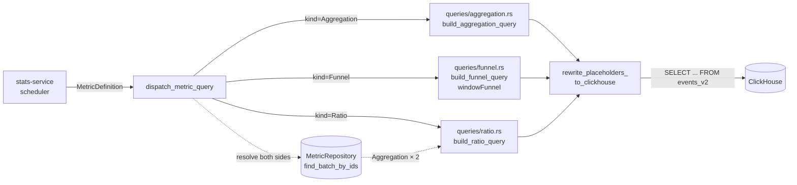

# Metrics

Metrics are the composable layer between raw event rows and statistical
results. Experiments target one or more `metric_definitions` via
`metric_ids[]` rather than referencing raw event keys directly — the
former (`metric_keys[]`) column was dropped in the Phase 7 cutover.

## Concept

A **metric definition** is an env-scoped, kind-discriminated SQL recipe.
Three kinds are supported in the initial implementation:

| Kind | Config | ClickHouse builder |
|------|--------|-------------------|
| **Aggregation** | `{ event_key, aggregator: count\|sum\|avg\|p50\|p90\|p99\|uniq, on_field: Option<String>, where_clause: Option<JsonLogic> }` | `queries/aggregation.rs` |
| **Ratio** | `{ numerator_metric_id, denominator_metric_id, min_denominator }` — both sides must themselves be Aggregations | `queries/ratio.rs` |
| **Funnel** | `{ steps: [{ event_key, where_clause }], window_seconds, count_repeats }` | `queries/funnel.rs` — `windowFunnel` |

Each kind has a `validate()` method enforcing shape invariants (funnel has
≥2 steps, ratio numerator and denominator are distinct, etc.). Cross-metric
references in `Ratio` are **not** enforced by PG foreign keys; integrity is
checked at compute time by the dispatcher (see below).

## Storage

```sql
CREATE TABLE metric_definitions (
    id              UUID         PRIMARY KEY,
    environment_id  UUID         NOT NULL REFERENCES environments(id),
    key             TEXT         NOT NULL,
    name            TEXT         NOT NULL,
    description     TEXT,
    kind            TEXT         NOT NULL CHECK (kind IN ('aggregation','ratio','funnel')),
    config          JSONB        NOT NULL,
    goal_direction  TEXT         NOT NULL DEFAULT 'increase',
    version         BIGINT       NOT NULL DEFAULT 1,
    created_at      TIMESTAMPTZ  NOT NULL DEFAULT now(),
    updated_at      TIMESTAMPTZ  NOT NULL DEFAULT now(),
    deleted_at      TIMESTAMPTZ
);

CREATE UNIQUE INDEX idx_metric_definitions_env_key_live
    ON metric_definitions(environment_id, key)
    WHERE deleted_at IS NULL;
```

The kind-specific config lives in the single `config` JSONB column rather
than per-kind sidecar tables — the kinds are short and infrequently
extended, and storing the discriminated union inline matches the serde
wire format used by both the REST API (`#[serde(tag = "kind")]`) and the
protobuf `oneof`. The same `version` column powers optimistic locking
across PATCH / DELETE the same way flags and segments do.

## Query Dispatch

`stitchd-stats-service` is the only consumer of metric definitions: when a
scheduled iteration computes results for an experiment, it walks the
experiment's `metric_ids[]` and asks the dispatcher to translate each one
into a ClickHouse query.



The dispatcher (`crates/stitchd-stats-service/src/dispatch.rs`) does two
things:

1. **Kind-based routing.** `Aggregation` and `Funnel` are self-describing
   — the dispatcher hands their config to the matching builder.
2. **Ratio resolution.** A `Ratio` carries only two `MetricId`s. The
   dispatcher resolves both via `MetricRepository::find_batch_by_ids`
   (one round-trip, not two) and asserts both sides are themselves
   `Aggregation` metrics. A funnel-of-ratios or ratio-of-ratios is
   rejected with `DispatchError::InvalidRatioMetric`.

The pure builders emit positional `{p0}, {p1}, …` placeholders so they
stay dialect-agnostic and unit-testable. The dispatcher's
`rewrite_placeholders_to_clickhouse` pass rewrites them to `?` for
`clickhouse-rs`, preserving bind order so the parallel `Vec<QueryBind>`
keeps aligning positionally.

## Event-Driven Recompute

When a metric definition changes (e.g. a funnel window widens, an
aggregation `where_clause` flips), the cached experiment results computed
from the old definition are stale until the next scheduled sweep. The
analytics-service `update_metric` handler closes this gap with a
**fire-and-forget recompute trigger**:

```mermaid
sequenceDiagram
    participant UI as Admin UI
    participant GW as gateway
    participant ANS as analytics-service<br/>update_metric
    participant SS as stats-service<br/>TriggerRecompute
    participant PG as PostgreSQL

    UI->>GW: PATCH /v1/metrics/{id}
    GW->>ANS: UpdateMetric(...)
    ANS->>PG: UPDATE metric_definitions
    PG-->>ANS: ok
    ANS-->>GW: 200
    GW-->>UI: 200 (UI returns immediately)

    Note over ANS: tokio::spawn — caller does NOT await
    ANS->>PG: list running experiments in env
    ANS->>ANS: filter by metric_ids.contains(metric_id)
    loop one per matching experiment
        ANS->>SS: TriggerRecompute(experiment_id)
        Note over SS: warn-on-failure;<br/>next experiment still triggered
    end
```

The trigger is gated on a `RecomputeTrigger` trait so it can be mocked in
unit tests without spinning up a real tonic channel. Errors are logged at
`WARN` but never propagated — a flaky recompute path must not block (or
fail) the user-visible PATCH.

## Metric Preview

`POST /v1/metrics/{id}/preview` runs the metric against the last 7 days
of event data and returns a time-series — used by the admin metric-builder
UI for instant feedback while authoring. The preview path reuses the same
`dispatch_metric_query` pipeline but with a synthetic `experiment_id` and
no variant split (the preview is just "what does this metric look like in
this env right now").

## Related

- [Events](./events.md) — what produces the rows that metrics aggregate.
- [Data Stores — ClickHouse](./data-stores.md) — partitioning + MV layout
  that the per-kind builders read from.
- [Service Flows](./service-flows.md) — where the metric-driven results
  path fits in the larger experimentation pipeline.
