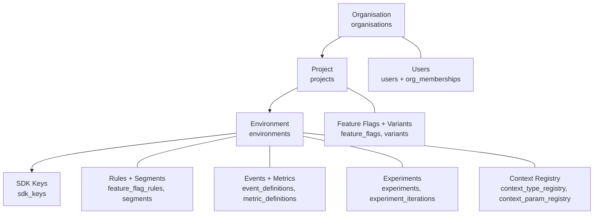

# Multi-Tenancy Model

Stitchd uses a **three-level hierarchy** — Organisation → Project → Environment
— with two distinct credential types stacked on top:

- **JWTs** authenticate **humans** (admin UI operators, API scripts).
- **SDK keys** authenticate **embedded SDKs** at the
  `(project, environment)` granularity.

Both credentials are validated at the gateway via separate Axum middlewares
(`auth_middleware` for JWTs, `sdk_auth_middleware` for SDK keys). The two
trees never cross — admin tokens cannot hit SDK telemetry routes, and SDK
keys cannot reach admin CRUD routes.

## Hierarchy



The `organisations`, `projects` and `environments` tables share a common
soft-delete + optimistic-concurrency shape:

```sql
-- excerpt from 20260411000001_organisations_projects_environments.sql
CREATE TABLE organisations (
    id          UUID        PRIMARY KEY DEFAULT gen_random_uuid(),
    name        TEXT        NOT NULL,
    created_at  TIMESTAMPTZ NOT NULL DEFAULT now(),
    updated_at  TIMESTAMPTZ NOT NULL DEFAULT now(),
    deleted_at  TIMESTAMPTZ,
    version     BIGINT      NOT NULL DEFAULT 1
);
```

`projects.organisation_id` and `environments.project_id` are FK columns —
hierarchy integrity is enforced at the database layer, not the application
layer.

## Scoping Rules

### Project-scoped — promoted across environments

| Entity | Why project-scoped |
|---|---|
| `feature_flags` (key, value_type, variants) | Promoting a flag from `dev` → `staging` → `prod` requires the same key + type across environments |
| `variants` | Variants belong to the flag definition, not to a per-env config |

### Environment-scoped — per-deployment configuration

| Entity | Source migration | Purpose |
|---|---|---|
| `feature_flag_rules` | `20260411000004` + later | Ordered AND/OR/NOT condition trees; "Is in segment" + "Flag evaluated with variant X" predicates |
| `feature_flags.default_rule_distribution` | `20260521000002` | Per-env percentage distribution for the default-rule fall-through |
| `segments` (rule-based + list-based) | `20260411000005` + `20260513*` | Audience definitions |
| `event_definitions` | `20260419000001` + `20260520000004` | Pre-registered event keys with `metric_type` + optional JSON-schema validation |
| `metric_definitions` | `20260520000001` | Composable Aggregation / Ratio / Funnel metrics |
| `experiments` + `experiment_iterations` | `20260419000002` + `20260521*` | A/B and multivariate experiment configs |
| `sdk_keys` | `20260411000002` | Per-environment credentials |
| `context_type_registry`, `context_param_registry` | `20260515000001` | Observed context types + parameters — autocomplete source for rule builder |
| `user_env_roles` | `20260421000001` | Per-environment human RBAC |

Each environment is fully independent — enabling a flag in `prod` does not
affect `staging`. Promotion is a deliberate operator action via the admin UI
or the management REST API.

### List-segment entries live elsewhere

List-segment include/exclude entries are NOT in PostgreSQL — they are stored
in ScyllaDB under the `stitchd_segments` keyspace, partitioned by
`(segment_id, context_type, generation)`. See [Data Stores](./data-stores.md).
PostgreSQL retains only the segment metadata row (name, type, counts, audit
trail).

## Human Identity & RBAC

A platform-level `users` table holds one row per human (email-unique), with
membership rows binding the user to one or more organisations:

```sql
-- excerpt from 20260421000001_auth_schema.sql
CREATE TABLE users (
    id             UUID        PRIMARY KEY DEFAULT gen_random_uuid(),
    email          TEXT        NOT NULL,
    display_name   TEXT        NOT NULL,
    password_hash  TEXT,                       -- argon2id; NULL for SSO-only users
    token_secret   UUID        NOT NULL DEFAULT gen_random_uuid(),
    totp_secret    BYTEA,                      -- AES-256-GCM encrypted
    totp_enabled   BOOLEAN     NOT NULL DEFAULT false,
    status         TEXT        NOT NULL DEFAULT 'active'
                       CHECK (status IN ('active', 'deactivated')),
    CONSTRAINT uq_users_email UNIQUE (email)
);

CREATE TABLE org_memberships (
    user_id  UUID NOT NULL REFERENCES users(id) ON DELETE CASCADE,
    org_id   UUID NOT NULL REFERENCES organisations(id) ON DELETE CASCADE,
    role     TEXT NOT NULL CHECK (role IN ('org_admin', 'org_member')),
    PRIMARY KEY (user_id, org_id)
);
```

A single user can be in multiple orgs; the JWT identifies which org the
session is acting within (the user picks one at login via `POST
/v1/auth/switch-org`).

### Role matrix

| Scope | Table | Roles | Granted by |
|---|---|---|---|
| Platform | `organisations.is_system` — the JWT carries `is_system=true` when the user picks the System org | `superadmin` | bootstrap seed (`STITCHD_SUPERADMIN_EMAIL` env var) |
| Organisation | `org_memberships.role` | `org_admin`, `org_member` | superadmin or another `org_admin` |
| Project | `user_project_roles.role` | `project_admin`, `project_viewer` | org admin |
| Environment | `user_env_roles.role` | `env_publisher`, `env_viewer` | org or project admin |

`is_system` users live in a special "System" organisation and have
gateway-wide access to the `/v1/superadmin/*` tree (org/user creation). The
gateway's `require_system_org` middleware enforces this, and the parallel
`require_non_system_org` middleware locks regular users out of superadmin
routes.

### Authentication mechanisms

| Mechanism | Implementation | Activated by |
|---|---|---|
| Password | Argon2id hash in `users.password_hash`. `POST /v1/auth/login` (`AuthService.LoginWithPassword`) | password `auth_providers` row + non-null `password_hash` |
| OIDC | `openidconnect 4` — endpoint type-state, PKCE flow. `POST /v1/orgs/{org}/auth/oidc/authorize` → callback `GET /v1/auth/oidc/{provider_id}/callback` | per-org `auth_providers` row with `provider_type = 'oidc'` |
| SAML 2.0 | `quick-xml` + `flate2`. `POST /v1/orgs/{org}/auth/saml/sso` initiate → ACS `POST /v1/auth/saml/{provider_id}/callback` | per-org `auth_providers` row with `provider_type = 'saml'` |
| MFA (TOTP) | `totp-rs 5`; secret AES-256-GCM encrypted via `STITCHD_AUTH_ENCRYPTION_KEY` | `users.totp_enabled = true` + populated `totp_secret` |
| Refresh token | SHA-256 hashed `refresh_tokens.token_hash`; rotation on every use; `device_hint` recorded | issued on every successful login |
| Invite | Hashed token in `invites.token_hash`; expires at `expires_at`; bound to `org_id` + `org_role` | `POST /v1/management/orgs/{org}/users` (org admin only) |

All five `auth_providers.provider_type` rows live per-org so a single platform
can host orgs with different SSO backends.

### JWT shape

JWTs are HS256 (HMAC-SHA256) signed with `STITCHD_JWT_SECRET`. Claims include:

| Claim | Source |
|---|---|
| `sub` | `users.id` |
| `org_id` | the org the user picked via `switch-org` (single-org users get this automatically) |
| `is_system` | true for the System org membership |
| `exp` / `iat` | issued + lifetime |

The admin UI decodes claims client-side (base64 of payload — never trusts
unverified) to render `/superadmin/*` vs `/org/:orgId/*` route trees;
verification still happens server-side on every request.

## SDK Identity

```sql
-- excerpt from 20260411000002_sdk_keys.sql
CREATE TABLE sdk_keys (
    id              UUID        PRIMARY KEY DEFAULT gen_random_uuid(),
    environment_id  UUID        NOT NULL REFERENCES environments(id),
    key_hash        TEXT        NOT NULL,    -- SHA-256(raw_key) hex
    is_active       BOOLEAN     NOT NULL DEFAULT TRUE,
    created_at      TIMESTAMPTZ NOT NULL DEFAULT now(),
    revoked_at      TIMESTAMPTZ
);
```

Properties:

- **Raw key is never persisted.** The admin UI displays the plaintext exactly
  once at create-time (`ManagementService.CreateSdkKey` returns `raw_key` in
  the response); subsequent reads return `is_active` + `created_at` only.
- **One env → many keys.** Minimum one active key per environment is the
  product invariant; the admin UI enforces this when revoking the last key.
- **Rotation** = create new + revoke old. Both calls live under
  `/v1/management/environments/{env}/sdk-keys`.
- **Lookup is cache-friendly.** `auth-service` keeps a 60s
  `Cache<key_hash, SdkKey>` (`moka 0.12`) so per-request validation is
  sub-millisecond after first hit. Revocation eagerly invalidates the cache
  entry. Backing index `idx_sdk_keys_key_hash_active` (migration
  `20260516000001`).

### SDK key scope

An SDK key carries exactly one `environment_id`. The gateway's
`sdk_auth_middleware` resolves the key, calls
`AuthService.ValidateCredential`, and injects an `SdkContext` extension:

```rust
// crates/stitchd-gateway/src/middleware/sdk_auth.rs
pub struct SdkContext {
    pub environment_id: String,    // forwarded as x-env-id
    pub organisation_id: String,   // for log correlation
    pub sdk_key_id: String,        // for audit logging
}
```

Downstream handlers forward `environment_id` as `x-env-id` gRPC metadata.
Backend services trust this — they do not re-validate the SDK key. This is
the **gateway-as-trust-boundary** invariant from `boundaries_20260518`.

## Tenant Isolation Guarantees

| Layer | Mechanism |
|---|---|
| Database | Every config table is scoped by FK to `organisation_id` / `project_id` / `environment_id`. Repository queries always carry the scope predicate |
| Audit | Every mutation goes through `PgAuditLogger`, which records `(actor, action, resource_type, resource_id, changes)` against the tenant's audit_log |
| Gateway | JWT routes call `RbacContext::authorise(resource_scope, action)` before any backend gRPC call — see `crates/stitchd-gateway/src/routes/mod.rs::require_permission` |
| SDK | `SdkContext.environment_id` is the only env_id forwarded; SDK cannot escape its scoped environment |
| OpenAPI | The exposed REST routes carry explicit `org_id` / `project_id` / `environment_id` path parameters; there is no implicit "current tenant" via session cookie |

Cross-tenant access is structurally impossible unless an operator has
`superadmin` privileges on the platform-level System org.

## Onboarding Flow

A typical bootstrap walks through the hierarchy top-down:

```text
1. superadmin → POST /v1/superadmin/orgs              { name: "Acme Corp" }
                                                       ↳ returns org_id + auto-created default project_id
2. org_admin  → POST /v1/management/orgs/{org}/users  { email, display_name, password, org_role }
3. org_admin  → POST /v1/management/projects/{p}/environments  { name: "production" }
4. org_admin  → POST /v1/management/environments/{e}/sdk-keys
                                                       ↳ returns raw_key — copy + store as STITCHD_SDK_KEY
5. application → SdkClient::init(SdkConfig::new(gateway_url, sdk_key))
```

Org creation auto-provisions a default `projects` row so step 1 returns a
ready-to-use `project_id`. Default environment creation is left to the
operator — the UI prompts for it on first login to the org.
