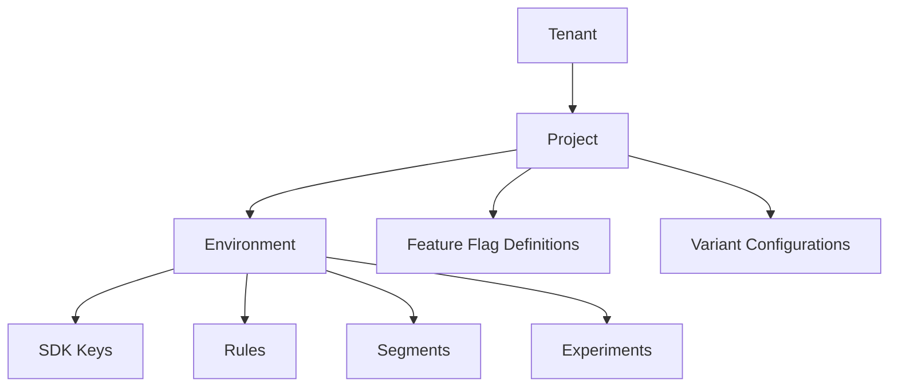

# Multi-Tenancy Model

## Scoping

- **Project level:** Feature Flag definitions and Variant configurations are shared across environments.
- **Environment level:** Rules, Segments, Experiments, and SDK Keys are environment-scoped.

## SDK Key Constraints

- Each environment must have at least one active SDK key at all times.
- Keys are scoped to a single `project + environment` pair.
- Project Admins manage key creation and revocation.
