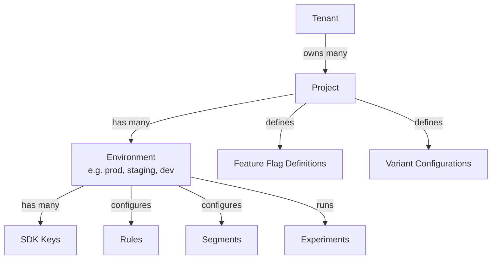

# Multi-Tenancy Model

Stitchd uses a four-level hierarchy: **Tenant → Project → Environment → SDK Key**.

## Hierarchy Diagram

## Scoping Rules

### Project-scoped (shared across environments)

| Entity | Notes |
|--------|-------|
| Feature Flag Definitions | The flag _key_ and _type_ are project-level |
| Variant Configurations | Which variants exist and their values |

Sharing definitions across environments ensures flag keys are consistent when promoting
from `dev` → `staging` → `prod`.

### Environment-scoped

| Entity | Notes |
|--------|-------|
| Rules | Which users/segments see which variant, in which environment |
| Segments | Rule-based and list-based segment definitions |
| SDK Keys | One or more keys per environment for SDK authentication |
| Experiments | A/B test and metric configurations |

Each environment is fully independent — enabling a flag in `prod` does not affect `staging`.

## SDK Key Isolation

An SDK key grants read access to exactly one `project + environment` combination.
The SDK can only see:

- Flag definitions for that project
- Active rules for that environment
- Segment definitions for that environment

It cannot read other environments' rules or other tenants' data.

## Tenant Isolation

All database queries include a `tenant_id` predicate. Tenants are fully isolated at the
query layer — there is no cross-tenant data leakage by design, and no shared-nothing
partitioning is required at the database level.
