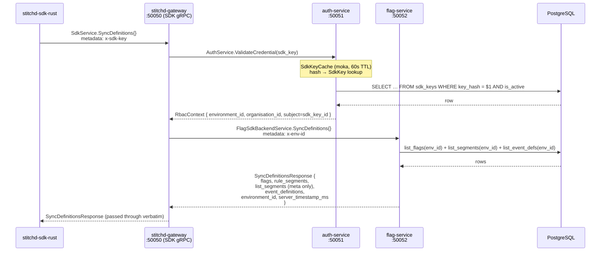
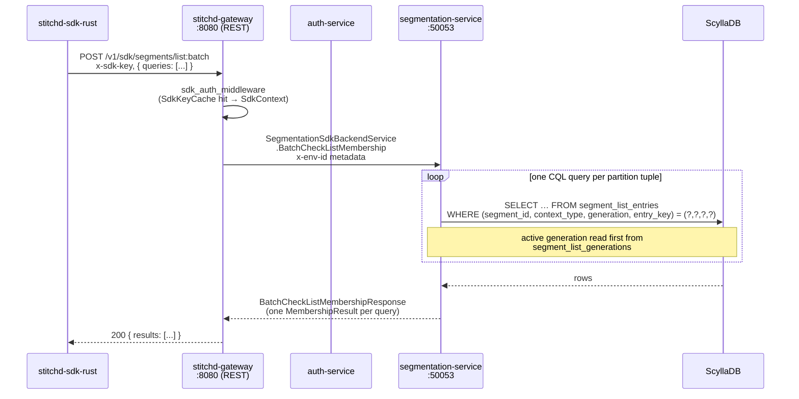
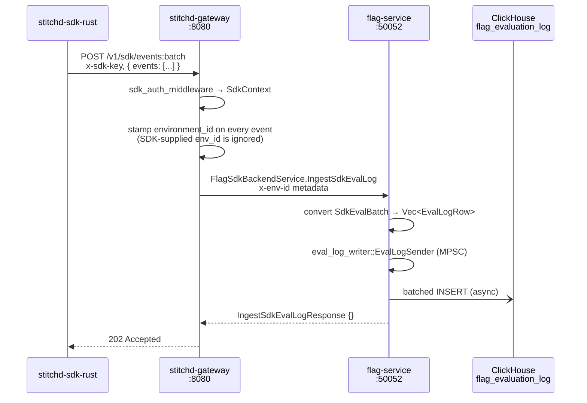
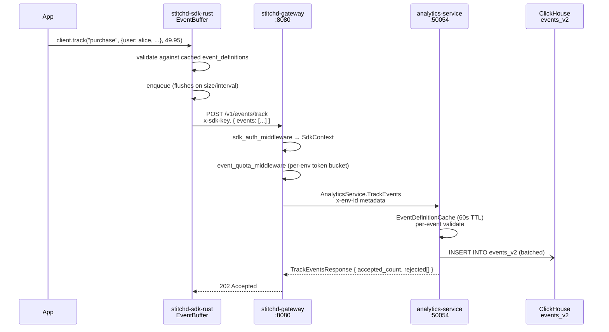
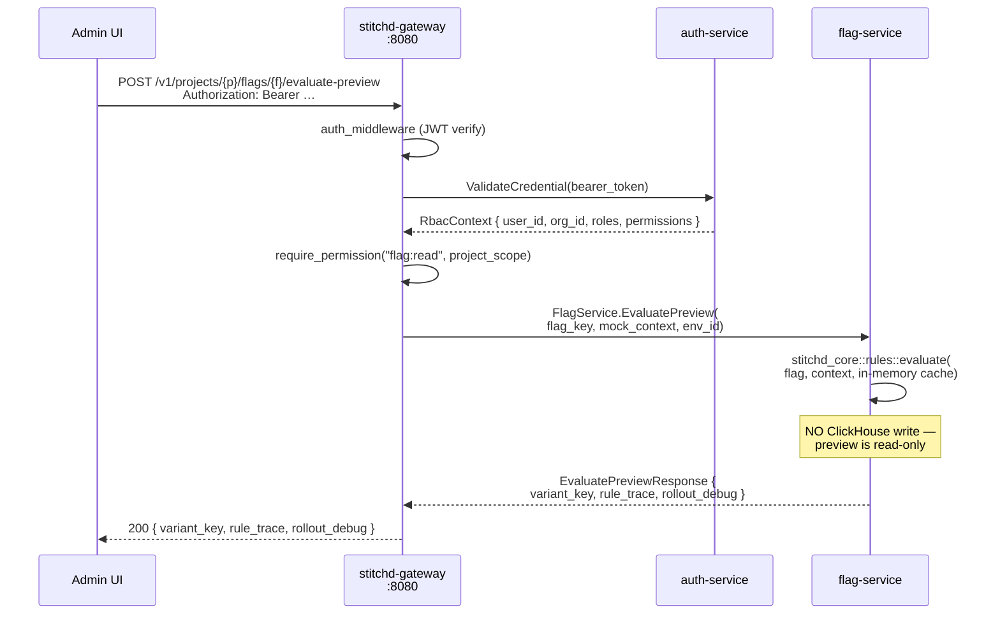
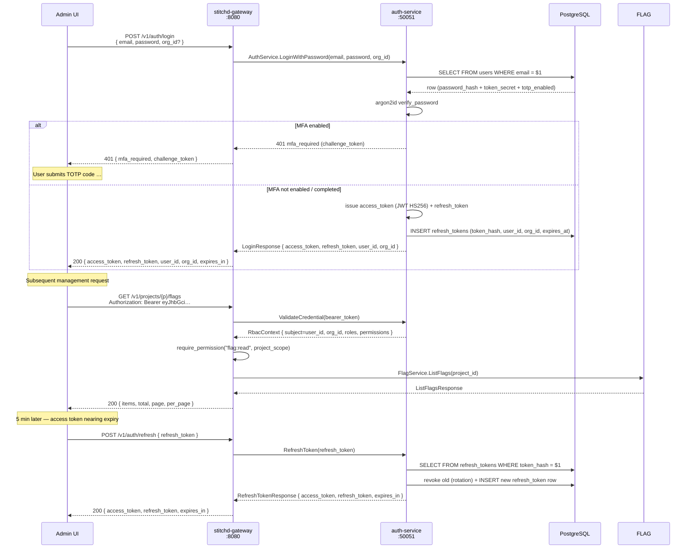
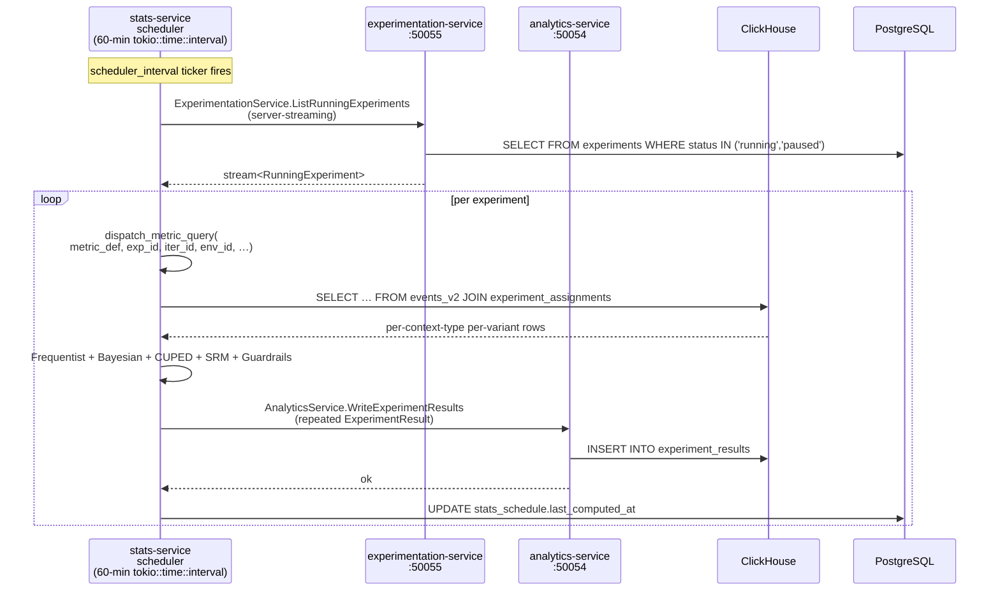
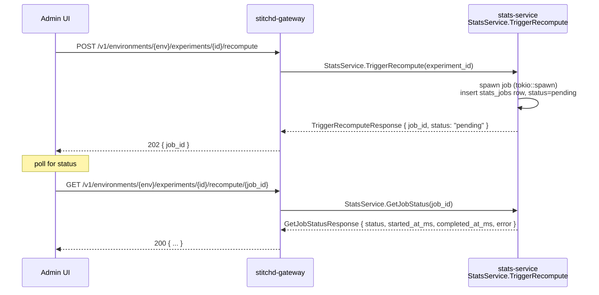
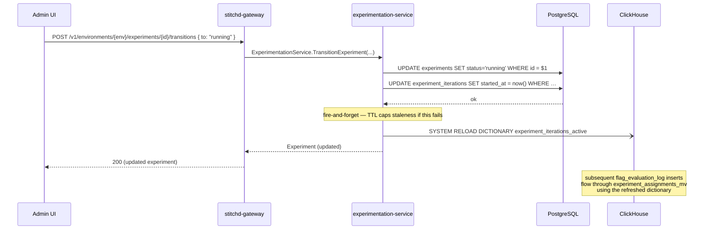

# Service Coordination Flows

This page collects sequence diagrams for the most common cross-service
request paths. All inter-service calls use gRPC over a tonic 0.14 channel
held in `GatewayState`. The gateway is the **single trust boundary** — it
authenticates the caller, then forwards the resolved `environment_id` (and
for JWT routes, the `RbacContext`) to backend services as gRPC metadata.

Service port reference:

| Service | gRPC port | Default address env var |
|---|---|---|
| `stitchd-gateway` (SDK gRPC) | `:50050` | — (in-process) |
| `stitchd-auth-service` | `:50051` | `STITCHD_AUTH_SERVICE_ADDR` |
| `stitchd-flag-service` | `:50052` | `STITCHD_FLAG_SERVICE_ADDR` |
| `stitchd-segmentation-service` | `:50053` | `STITCHD_SEGMENTATION_SERVICE_ADDR` |
| `stitchd-analytics-service` | `:50054` | `STITCHD_ANALYTICS_SERVICE_ADDR` |
| `stitchd-experimentation-service` | `:50055` | `STITCHD_EXPERIMENTATION_SERVICE_ADDR` |
| `stitchd-stats-service` | `:50056` | `STITCHD_STATS_SERVICE_ADDR` |

## SDK Definition Sync

An SDK polls the gateway every `definition_poll_interval` (default 30s)
for the full flag + segment + event-definition snapshot. The first sync
happens synchronously inside `SdkClient::init` and the background task
takes over from there.



The gateway's SDK gRPC port (`:50050`) hosts `SdkService` —
`build_grpc_server` in `crates/stitchd-gateway/src/grpc_server.rs` wires
the two `SdkService` RPCs (`SyncDefinitions`, `IngestSdkEvalLog`) to
`FlagSdkBackendService` on the flag-service. SDKs never see backend
services directly.

## Per-Eval List-Segment Membership

When a flag evaluation references a list-based segment and the LRU
doesn't have the relevant entry, the SDK issues a batched REST call to
resolve membership:



The response is keyed the same way as the request — N queries in, N
results out, same order. The SDK populates its LRU and the next
evaluation against any segment in the response is a cache hit.

## SDK Event Flush — Evaluation Events

The SDK emits one `FlagEvaluationEvent` per `evaluate()` call into a
bounded queue. The background `FlushTask` drains it every
`event_flush_interval` (default 5s) or when `event_batch_size` (default
100) events accumulate.



Each `FlagEvaluationEvent` becomes one row in `flag_evaluation_log` with
`targeting_on`, `matched_rule_id`, `variant_key`, `context_type`,
`context_key`, `evaluated_at`. This is the substrate for the
[experiment attribution pipeline](../experimentation/attribution.md) —
the `experiment_assignments_mv` watches inserts here and routes them to
`experiment_assignments`.

## SDK Track Event Flush — Metric Events

Distinct from evaluation events: `client.track(event_key, ...)` enqueues
on the `EventBuffer` and flushes to a different endpoint that goes
through analytics-service into `events_v2`.



`event_quota_middleware` enforces a per-env-id token bucket (default 1000
events/sec, configurable via `STITCHD_EVENT_QUOTA_PER_SEC`). The 5 MiB
body limit is applied only to this route via a per-route `DefaultBodyLimit`
layer.

## Server-Side Flag Evaluate Preview

Used by the admin UI's "Test" panel. Runs the same rule engine as the
SDK, but on `flag-service` against a user-supplied mock context, and
returns a full rule trace.



The preview never writes to the eval log — admin curiosity must not
contaminate experiment exposures.

## Human Login + Token Refresh



JWT validation flows through `auth_middleware` on every authenticated
request. The `RbacContext` injected into request extensions carries
`is_system` so the gateway's `require_system_org` / `require_non_system_org`
guards can short-circuit unauthorised routes before any backend gRPC call.

## OIDC / SAML Login

The `/v1/auth/oidc/*` and `/v1/auth/saml/*` route trees follow the
standard browser-mediated redirect dance. Both terminate in the same
JWT issuance that password login uses, so post-login behaviour is
identical.

```mermaid
sequenceDiagram
    participant UI as Admin UI
    participant GW as stitchd-gateway
    participant AUTH as auth-service<br/>(OidcLoginService)
    participant IDP as External IdP

    UI->>GW: POST /v1/orgs/{org}/auth/oidc/authorize
    GW->>AUTH: OidcAuthorize(org_id, redirect_uri)
    Note over AUTH: build PKCE challenge,<br/>store in OidcStateStore (300s TTL)
    AUTH-->>GW: { authorize_url, state }
    GW-->>UI: 200 { authorize_url, state }
    UI->>IDP: redirect to authorize_url

    Note over IDP: user authenticates
    IDP->>GW: GET /v1/auth/oidc/{provider_id}/callback?code=…&state=…
    GW->>AUTH: OidcCallback(code, state)
    AUTH->>IDP: exchange code → id_token (PKCE-protected)
    IDP-->>AUTH: id_token (signed JWT)
    AUTH->>AUTH: verify signature; extract claims
    AUTH->>AUTH: upsert user; assign org_membership
    AUTH->>AUTH: issue access_token + refresh_token
    AUTH-->>GW: LoginResponse
    GW-->>UI: redirect with tokens (URL-encoded fragment)
```

SAML follows the same pattern with `SamlLoginService` and `SamlRelayStore`
(600s TTL): `POST .../sso` returns a SAML AuthnRequest XML payload to
post to the IdP, the IdP POSTs the assertion back to the ACS at
`POST /v1/auth/saml/{provider_id}/callback`, and `LiveSamlExchanger`
validates the assertion (`quick-xml` + `flate2`) before issuing JWTs.

## Experiment Compute (Scheduled & On-Demand)

`stitchd-stats-service` runs two loops:



The on-demand path is reachable via `POST /v1/.../experiments/{id}/recompute`:



`TriggerRecompute` is also called fire-and-forget by analytics-service
when a metric or event definition changes — see [Metrics § Event-Driven
Recompute](./metrics.md#event-driven-recompute).

## Iteration Start / Stop (CH Dictionary Reload)

When an experiment iteration starts or stops, the
`experiment_iterations_active` ClickHouse dictionary must reflect the
change quickly enough for `experiment_assignments_mv` to route new evals
correctly. The natural dictionary TTL is 30–60s; the experimentation
service additionally fires an explicit reload:


