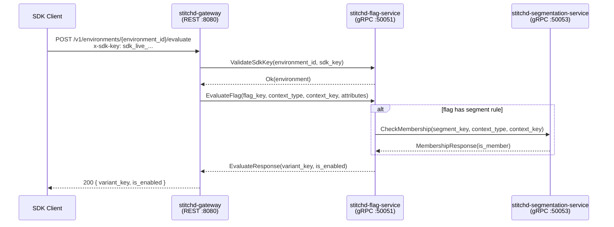
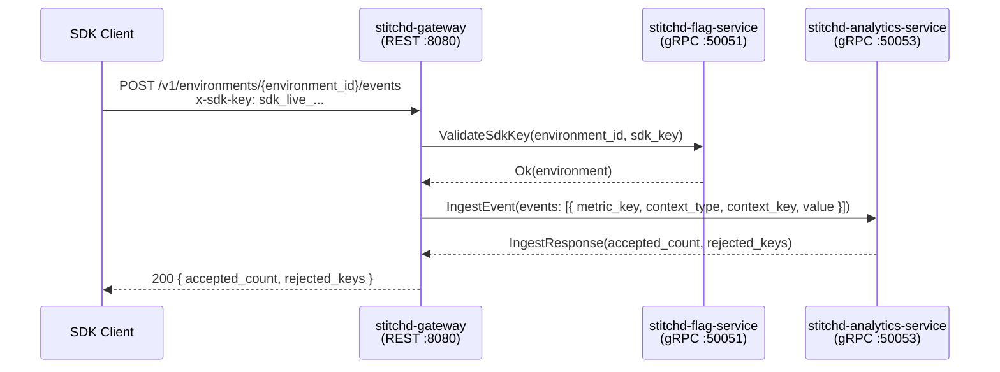
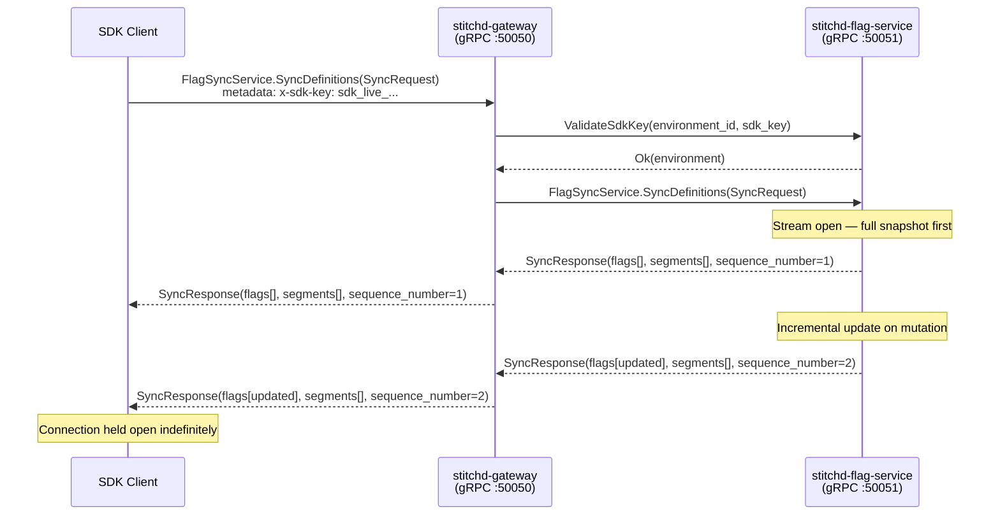
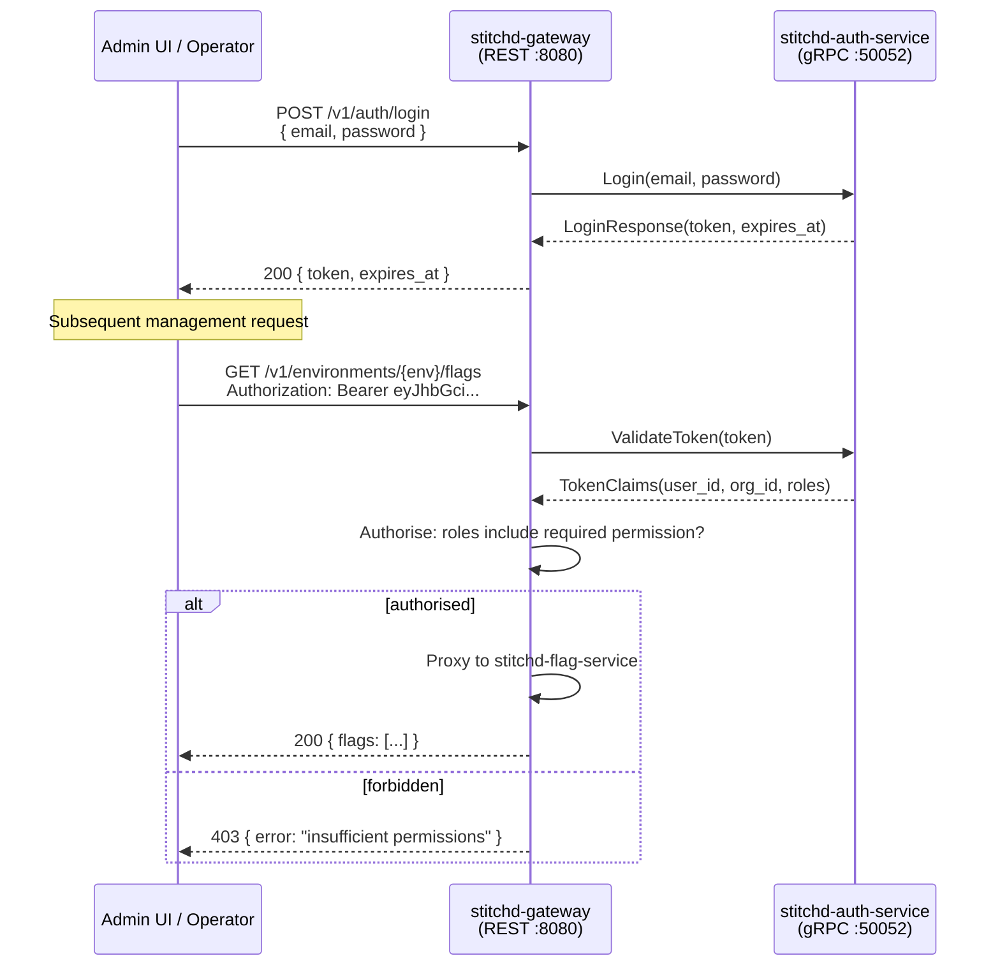

# Service Coordination Flows

Key request flows across the microservice mesh. All inter-service calls use gRPC.

## Flag Evaluation

An SDK client evaluates a feature flag. The gateway authenticates the SDK key, then asks the flag service to evaluate the flag for the given context. The flag service may call the segmentation service to resolve rule-based targeting.

## Event Ingestion

An SDK client records a metric event. The gateway authenticates the SDK key, then forwards the event to the analytics service for storage and downstream processing.

## Definition Sync

An SDK client opens a long-lived gRPC streaming connection to receive the full flag/segment definition set and incremental updates. The gateway passes the stream through to the flag service.

## Human Auth

An admin user or the Admin UI logs in and obtains a JWT. Subsequent management requests carry the JWT which the gateway validates before proxying.

