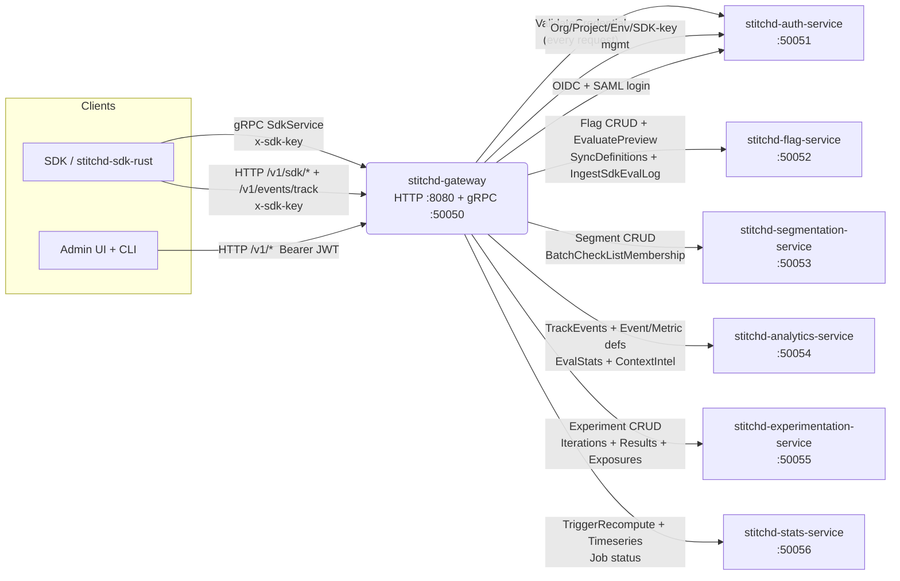

# Internal gRPC

The gateway is the only **gRPC client** for downstream services, and one of two
**gRPC servers** in the deployment (alongside the services themselves). This
page covers both sides — what the gateway exposes to SDK clients on port
`50050`, and what it consumes from the seven backend services.

## Topology



Every authenticated request that the gateway accepts triggers exactly one
`AuthService::ValidateCredential` call against `stitchd-auth-service` (cached
in-process by `SdkKeyCache` for SDK keys, no caching for JWTs) and then fans
out to whichever downstream service owns the data.

## What the gateway **exposes** (gRPC server on `:50050`)

The gateway hosts one tonic server on `STITCHD_GATEWAY_GRPC_PORT` (default
`50050`). It implements `SdkService` from `sdks/spec/proto/sdk/v1/service.proto`,
which is the SDK's wire contract.

| RPC                                            | Method type | Forwards to                                          |
|------------------------------------------------|-------------|------------------------------------------------------|
| `SdkService.SyncDefinitions`                   | Unary       | `FlagSdkBackendService.SyncDefinitions` (flag-service) |
| `SdkService.IngestSdkEvalLog`                  | Unary       | `FlagSdkBackendService.IngestSdkEvalLog` (flag-service) |

Both RPCs are unary in the current revision — server-streaming sync is
deferred to a future track. The SDK polls `SyncDefinitions` on its
configured `definition_poll_interval` (default 30 s) and gets back the full
flag + rule-segment + list-segment-meta + event-definition snapshot.

### Authenticating gRPC calls

SDK clients put their key in gRPC metadata, not in the request message:

```
x-sdk-key: stk_live_abc123
```

The gateway's `GatewaySdkServiceImpl::authenticate` reads the metadata,
calls `AuthService::ValidateCredential`, and on success forwards the
inbound payload to the backend with the resolved env_id added as
`x-env-id` metadata. `IngestSdkEvalLog` additionally **overwrites** the
`environment_id` field on every event in the batch from the resolved
context — any value the SDK supplies is ignored.

A missing or unparseable `x-sdk-key` returns gRPC `Unauthenticated`. A
rejected key propagates the auth service's `Unauthenticated` verbatim.

### Connecting from a non-Rust client

The proto file lives at `sdks/spec/proto/sdk/v1/service.proto`. Any
gRPC client can connect — the only Stitchd-specific bit is the
`x-sdk-key` metadata header.

```python
import grpc
from stitchd.sdk.v1 import service_pb2, service_pb2_grpc

channel = grpc.insecure_channel("gateway.local:50050")
stub = service_pb2_grpc.SdkServiceStub(channel)
metadata = [("x-sdk-key", "stk_live_abc123")]

resp = stub.SyncDefinitions(service_pb2.SyncDefinitionsRequest(), metadata=metadata)
print(len(resp.flags), "flags,", len(resp.rule_segments), "rule segments")
```

## What the gateway **consumes** (gRPC clients to backends)

The gateway's `GatewayState` holds a long-lived tonic `Channel` to each
downstream service plus a typed client per service hosted on the channel.
Multiple services share a channel where they're hosted on the same port
(auth-service hosts five services on `:50051`).

### `stitchd-auth-service` — `STITCHD_AUTH_SERVICE_ADDR` (default `localhost:50051`)

Hosts five tonic services on one port. The gateway holds five client
handles, all multiplexed onto the same channel.

| Service                  | RPCs the gateway calls                                                                                  |
|--------------------------|---------------------------------------------------------------------------------------------------------|
| `AuthService`            | `ValidateCredential` (every authenticated request), `LoginWithPassword`, `RefreshToken`, `ListUserOrgs`, `SwitchOrg` |
| `ManagementService`      | `CreateOrg`, `ListOrgs`, `GetOrg`, `CreateProject`, `ListProjects`, `RenameProject`, `DeleteProject`, `CreateEnvironment`, `ListEnvironments`, `RenameEnvironment`, `DeleteEnvironment`, `CreateSdkKey`, `ListSdkKeys`, `RevokeSdkKey`, `CreateUser`, `ListOrgUsers`, `RemoveOrgUser` |
| `AuthProviderService`    | `CreateAuthProvider`, `ListAuthProviders`, `GetAuthProvider`, `UpdateAuthProvider`, `DeleteAuthProvider`, `GetSamlSpMetadata` |
| `OidcLoginService`       | `OidcAuthorize`, `OidcCallback`                                                                         |
| `SamlLoginService`       | `SamlSsoInitiate`, `SamlAcsCallback`                                                                    |

### `stitchd-flag-service` — `STITCHD_FLAG_SERVICE_ADDR` (default `localhost:50052`)

Hosts the management `FlagService` plus the SDK backend
`FlagSdkBackendService`. The gateway holds separate clients for each.

| Service                  | RPCs the gateway calls                                                                                  |
|--------------------------|---------------------------------------------------------------------------------------------------------|
| `FlagService`            | `ListFlags`, `GetFlag`, `MutateFlag`, `UpdateFlagHashing`, `SetDefaultRuleDistribution`, `EvaluatePreview` |
| `FlagSdkBackendService`  | `SyncDefinitions`, `IngestSdkEvalLog` (forwarded from the gRPC server above and from `POST /v1/sdk/events:batch`) |

### `stitchd-segmentation-service` — `STITCHD_SEGMENTATION_SERVICE_ADDR` (default `localhost:50053`)

| Service                          | RPCs the gateway calls                                                                                  |
|----------------------------------|---------------------------------------------------------------------------------------------------------|
| `SegmentationService`            | `ListSegments`, `GetSegment`, `CreateAdminSegment`, `UpdateAdminSegment`, `DeleteAdminSegment`, `PatchSegmentEntries`, `LookupSegmentEntry`, `EvaluateMembership` |
| `SegmentationSdkBackendService`  | `BatchCheckListMembership` (forwarded from `POST /v1/sdk/segments/list:batch`)                          |

### `stitchd-analytics-service` — `STITCHD_ANALYTICS_SERVICE_ADDR` (default `localhost:50054`)

Owns event ingest, event/metric definitions, and analytics-side reads.
Inherits the responsibilities of the retired event-service.

| Service             | RPCs the gateway calls                                                                                  |
|---------------------|---------------------------------------------------------------------------------------------------------|
| `AnalyticsService`  | `TrackEvents` (from `/v1/events/track` and `/v1/admin/events/track`), `CreateEventDefinition`, `GetEventDefinition`, `ListEventDefinitions`, `UpdateEventDefinition`, `DeleteEventDefinition`, `GetEventFirings`, `GetEventStats`, `CreateMetric`, `GetMetric`, `ListMetrics`, `UpdateMetric`, `DeleteMetric`, `PreviewMetric`, `GetEvalStats`, `RegisterContext`, `ListContextTypes`, `ListContextParams`, `GetContextIntelligence` |

### `stitchd-experimentation-service` — `STITCHD_EXPERIMENTATION_SERVICE_ADDR` (default `localhost:50055`)

| Service                  | RPCs the gateway calls                                                                                  |
|--------------------------|---------------------------------------------------------------------------------------------------------|
| `ExperimentationService` | `ListExperiments`, `GetExperiment`, `CreateExperiment`, `UpdateExperiment`, `DeleteExperiment`, `TransitionExperiment`, `ListIterations`, `GetExperimentIteration`, `GetResults`, `ListExposures` |

### `stitchd-stats-service` — `STITCHD_STATS_SERVICE_ADDR` (default `localhost:50056`)

| Service        | RPCs the gateway calls                                                                              |
|----------------|-----------------------------------------------------------------------------------------------------|
| `StatsService` | `TriggerRecompute`, `GetJobStatus`, `GetExperimentTimeseries`                                       |

## Trust-boundary contract

A single rule, enforced everywhere:

> **The gateway is the only process that ever validates an SDK key.**
> Backend services trust the `x-env-id` gRPC metadata header that the
> gateway stamps on every forwarded call, and **never** see the raw key.

Concretely, this means:

- The gateway calls `AuthService::ValidateCredential` for the SDK key
  on each inbound request (REST or gRPC).
- The gateway forwards the resolved `environment_id` via `x-env-id`
  metadata on the outbound tonic request.
- Downstream services authenticate the gateway implicitly (network
  policy + cluster-internal mTLS, if configured), read `x-env-id`, and
  scope all queries by it.

`crates/stitchd-gateway/src/grpc_server.rs` and `routes/sdk_backend.rs`
contain the two implementations of this pattern — both call a small
`inject_env_id_metadata` helper to enforce that env_id is always present
and well-formed when proxying.

## Proto sources

| Package                          | File                                                              |
|----------------------------------|-------------------------------------------------------------------|
| `stitchd.auth.v1`                | `proto/auth/v1/auth_service.proto`                                |
| `stitchd.auth.v1`                | `proto/auth/v1/management.proto` (AuthProviderService)            |
| `stitchd.auth.v1`                | `proto/auth/v1/oidc_login.proto`                                  |
| `stitchd.auth.v1`                | `proto/auth/v1/saml_login.proto`                                  |
| `stitchd.management.v1`          | `proto/management/v1/management_service.proto`                    |
| `stitchd.flags.v1`               | `proto/flags/v1/flag_service.proto`                               |
| `stitchd.flags.v1`               | `proto/flags/v1/flag_sync.proto`                                  |
| `stitchd.segments.v1`            | `proto/segments/v1/segmentation_service.proto`                    |
| `stitchd.analytics.v1`           | `proto/analytics/v1/analytics.proto`                              |
| `stitchd.experiments.v1`         | `proto/experiments/v1/experimentation_service.proto`              |
| `stitchd.stats.v1`               | `proto/stats/v1/stats_service.proto`                              |
| `stitchd.sdk.v1` (SDK contract)  | `sdks/spec/proto/sdk/v1/service.proto`, `sdks/spec/proto/sdk/v1/backend.proto` |

Generated Rust bindings live in the `stitchd-proto` crate; full proto
schemas are rendered by `cargo xtask docs` into the `gRPC` chapter of
this book.
