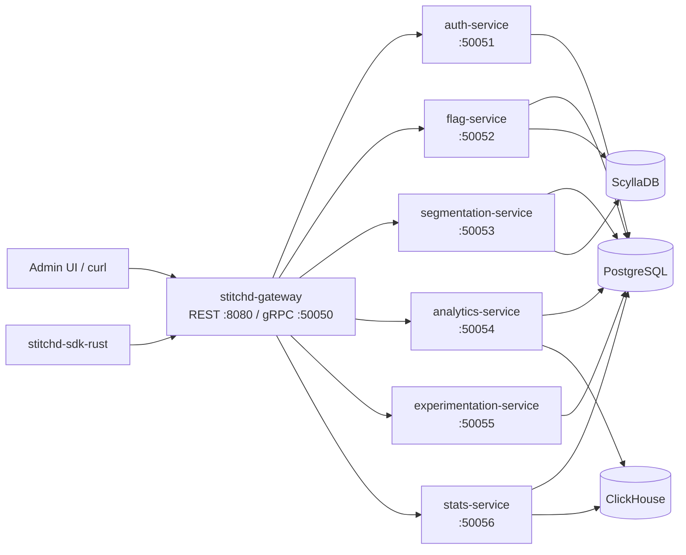

# Stitchd Feature Flag

Stitchd Feature Flag is a self-hosted, multi-tenant platform for feature flagging
and experimentation, written in Rust. It is structured as **six gRPC microservices
behind a single REST gateway**, with three purpose-fit data stores
(PostgreSQL + ClickHouse + ScyllaDB) and a React 19 admin console.



The gateway is the **single trust boundary** — every SDK key validation, JWT
verification and RBAC check happens there. Backend services trust the
gateway-supplied `x-env-id` gRPC metadata header and do not re-validate.

## What ships in this repo

| Capability | Status (2026-05-22) |
|---|---|
| Typed feature flags + rule engine + percentage rollout | Complete |
| Rule-based + list-based segmentation (ScyllaDB) | Complete |
| Server-side Rust SDK (in-process eval + polling + LRU cache) | Complete |
| Pre-registered events + composable metrics (Aggregation / Ratio / Funnel) | Complete |
| Experimentation — first-exposure ITT attribution, per-context-type stats | Complete |
| Frequentist + Bayesian + CUPED + SRM + Guardrails | Complete |
| Human auth — JWT, OIDC, SAML, TOTP MFA, invites, rate limiting | Complete |
| Admin UI (React 19 + Vite 8 + TypeScript 6) | Complete |
| Per-environment RBAC (`env_publisher` / `env_viewer`) + SDK key rotation | Complete |
| Audit logging + optimistic concurrency on every mutable entity | Complete |
| Self-host on Docker Compose (PG 16 + CH 24 + Scylla 6) | Complete |

## Documentation map

This site is organised by audience rather than by file layout:

- **[Public / Gateway Endpoints](./gateway/overview.md)** — REST contracts, SDK
  endpoints, the SDK-facing gRPC service, OpenAPI spec, and the admin JWT
  surface.
- **[Internal gRPC Services](./grpc/README.md)** — protobuf reference for every
  backend service. Auto-generated from `proto/*.proto` by xtask.
- **[Service Coordination Flows](./architecture/service-flows.md)** — sequence
  diagrams for the common cross-service request paths (flag eval, event ingest,
  experiment recompute, human login).
- **[Rust SDK](./sdk/README.md)** — `stitchd-sdk-rust` quickstart, config
  reference, polling lifecycle, eval semantics, and event-track contract.
- **[Deployment](./deployment/README.md)** — self-hosting guide covering
  Postgres, ClickHouse, Scylla, environment variables, and SDK key rotation.
- **[Architecture](./architecture/README.md)** — system topology, multi-tenancy
  model, the dual + Scylla data-store split, the events ingestion path, the
  metric-definitions primitives, and the in-process flag evaluation flow.
- **[Experimentation](./experimentation/index.md)** — first-exposure
  attribution pipeline (`flag_evaluation_log_v2` → `experiment_assignments_mv`),
  default-rule experiments, whole-flag lock semantics, per-context-type stats.

## Where things live in the source tree

| Path | Contents |
|---|---|
| `crates/stitchd-gateway/` | REST router, SDK gRPC server, middleware (`auth`, `sdk_auth`, `event_quota`), OpenAPI export |
| `crates/stitchd-{auth,flag,segmentation,analytics,experimentation,stats}-service/` | Six backend services, each a tonic gRPC binary |
| `crates/stitchd-core/` | Domain model, rule engine, hashing (`siphasher` / `murmur3` / `sha2`), ID types, stats math |
| `crates/stitchd-db/` | Sqlx repositories, ClickHouse client, Scylla session, PG migrations under `migrations/`, Scylla migrations under `scylla-migrations/` |
| `crates/stitchd-event-writer/` | ClickHouse ingestion + CH migration runner; CH migrations under `migrations/` |
| `crates/stitchd-proto/` | `.proto` build script + generated tonic stubs |
| `proto/` | Source-of-truth protobuf for every gRPC service |
| `sdks/rust/` | `stitchd-sdk-rust` — server-side Rust SDK |
| `sdks/spec/` | Language-neutral SDK contract (proto, OpenAPI, fixtures) |
| `admin/` | React 19 + Vite admin console |
| `docs/` | This mdBook site — built by `cargo run -p xtask -- docs` |

## Build + run in 60 seconds

```bash
git clone https://github.com/stitchd-dev/feature-flag.git
cd feature-flag
cp .env.example .env
docker compose up -d --wait
```

Then visit:

- **Admin UI** — `http://localhost:5173`
- **Gateway REST** — `http://localhost:8080` (health: `GET /v1/health`)
- **Gateway Prometheus** — `http://localhost:8080/metrics` (served on the same port as REST)
- **SDK gRPC** — `localhost:50050`

See [Deployment](./deployment/README.md) for a fuller walk-through, including
the `STITCHD_*` environment variable matrix, the SDK key bootstrap, and how to
attach an existing Postgres or ClickHouse cluster instead of the bundled
containers.
